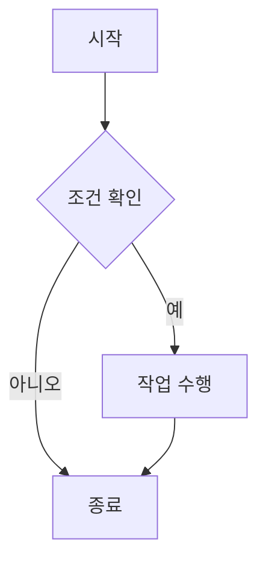
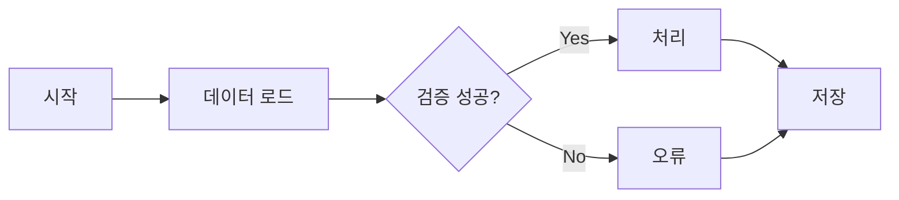

# 새김 (Saekim) - 마크다운 에디터


> 코드와 다이어그램을 자유롭게 다루는 개발자를 위한 로컬 마크다운 에디터

## 📝 프로젝트 소개

**새김(Saekim)**은 개발자와 학생을 위한 **로컬 우선(Local-First)** 마크다운 에디터입니다. 
온라인 에디터의 프라이버시 우려를 해결하고, 코드 작성과 문서화를 하나의 통합 환경에서 처리할 수 있도록 설계되었습니다.

### 개발 동기

#### 1. **프라이버시 보호**
- 기존 온라인 에디터들은 사용자 데이터를 서버에 저장하거나 분석에 활용
- 민감한 코드나 연구 노트를 안전하게 로컬 환경에서 관리 가능

#### 2. **개발자 친화적 환경**
- 코드 하이라이팅, 다이어그램, 수식을 하나의 도구로 통합
- 학습 노트, 기술 문서, API 문서 작성에 최적화
- GitHub Flavored Markdown (GFM) 호환

#### 3. **오프라인 작업**
- 인터넷 연결 없이도 모든 기능 사용 가능
- PDF/DOCX 변환도 로컬에서 처리 (외부 API 불필요)

#### 4. **오픈소스 철학**
- 모든 코드와 의존성을 투명하게 공개
- 커뮤니티 기여와 개선 가능

---

## ✨ 주요 기능

### 📄 편집 및 미리보기

#### 실시간 렌더링
- ✅ **Split View**: 편집창과 미리보기를 동시에 표시
- ✅ **자동 스크롤 동기화**: 편집 위치에 따라 미리보기 자동 이동
- ✅ **라이브 업데이트**: 입력 즉시 미리보기에 반영


#### 코드 하이라이팅 (Highlight.js 11.9.0)
- ✅ **지원 언어** (9개):
  - Python, JavaScript, Java, C++, CSS
  - JSON, Markdown, SQL, Bash
- ✅ **테마별 최적화**: 에디터 테마와 자동 매칭
- ✅ **라인 넘버링**: 코드 블록에 줄 번호 표시

```python
# Python 코드 예시
def fibonacci(n):
    if n <= 1:
        return n
    return fibonacci(n-1) + fibonacci(n-2)
```

#### 다이어그램 렌더링 (Mermaid.js 10.6.1)
- ✅ **지원 다이어그램** (9종):
  - Flowchart (플로우차트)
  - Sequence Diagram (시퀀스 다이어그램)
  - Class Diagram (클래스 다이어그램)
  - State Diagram (상태 다이어그램)
  - Entity Relationship Diagram (ER 다이어그램)
  - Gantt Chart (간트 차트)
  - Pie Chart (파이 차트)
  - Git Graph (깃 그래프)
  - User Journey (사용자 여정)



#### 수학 수식 렌더링 (KaTeX 0.16.9)
- ✅ **인라인 수식**: `$E=mc^2$` → $E=mc^2$
- ✅ **블록 수식**: 
  ```latex
  $$
  \int_a^b f(x)dx = F(b) - F(a)
  $$
  ```
- ✅ **LaTeX 문법**: 분수, 행렬, 적분, 미분, 그리스 문자 등 전체 지원

---

### 📁 파일 관리

#### 멀티탭 편집
- ✅ 여러 파일을 동시에 열어서 작업 가능
- ✅ 탭 간 빠른 전환 (Ctrl+Tab / Ctrl+Shift+Tab)
- ✅ 탭 닫기, 모든 탭 닫기 기능

#### 세션 관리
- ✅ **자동 세션 저장**: 열려있던 파일 목록과 위치 저장
- ✅ **세션 복원**: 프로그램 재시작 시 마지막 작업 상태 복구
- ✅ **비저장 내용 보호**: 저장하지 않은 파일 내용 임시 보관

#### 자동 저장
- ✅ **5초 간격** 자동 저장 (설정 변경 가능)
- ✅ 저장 실패 시 알림 및 재시도
- ✅ 파일 수정 시간 자동 기록

#### 파일 작업
- ✅ 새 파일 생성 (Ctrl+N)
- ✅ 파일 열기 (Ctrl+O)
- ✅ 파일 저장 (Ctrl+S)
- ✅ 다른 이름으로 저장 (Ctrl+Shift+S)
- ✅ 최근 파일 목록 (빠른 접근)

---

### 🔄 문서 변환

#### Markdown → PDF (Playwright 기반)
- ✅ **고품질 변환**: CSS 스타일 완벽 재현
- ✅ **다이어그램 포함**: Mermaid 차트 자동 렌더링
- ✅ **수식 포함**: KaTeX 수식 벡터 그래픽으로 변환
- ✅ **페이지 설정**: A4, 여백 자동 조정
- ✅ **단축키**: Ctrl+E

**기술 상세**:
- Playwright Chromium 엔진 사용 (헤드리스 브라우저)
- HTML → PDF 변환 시 `page.pdf()` API 활용
- 참조: [Playwright PDF Documentation](https://playwright.dev/python/docs/api/class-page#page-pdf)

#### PDF → Markdown (PyMuPDF 기반)
- ✅ **텍스트 추출**: PDF 문서의 텍스트를 마크다운으로 변환
- ✅ **표 인식**: pdfplumber로 표 구조 파싱
- ✅ **제목 계층 구조**: 폰트 크기 기반 제목 레벨 자동 판단
- ✅ **레이아웃 보존**: 단락, 리스트 구조 유지

**기술 상세**:
- PyMuPDF (fitz) 라이브러리 사용
- pdfplumber로 표 경계선 감지 및 마크다운 테이블 변환
- 코드 위치: `src/backend/converter.py` Line 617-1467

#### Markdown → DOCX (python-docx 기반)
- ✅ **스타일 적용**: 제목, 본문, 코드 블록 스타일 구분
- ✅ **이미지 삽입**: 마크다운 이미지 자동 포함
- ✅ **표 변환**: 마크다운 표 → Word 표
- ✅ **리스트 변환**: 순서 있는/없는 리스트 지원

**기술 상세**:
- python-docx 라이브러리 사용
- 정규표현식 기반 마크다운 파싱
- 코드 위치: `src/backend/converter.py` Line 1908-1952

#### Markdown → HTML
- ✅ **Marked.js 엔진**: 고성능 마크다운 파서
- ✅ **XSS 방지**: DOMPurify로 악성 스크립트 필터링
- ✅ **스탠드얼론 HTML**: CSS 인라인 포함

---

### 🎨 테마 시스템

**5가지 프리셋 테마** 제공:

| 테마 이름 | 설명 | 주요 색상 |
|----------|------|----------|
| **Nord** | 북유럽 스타일 다크 테마 | 청록색 (#88C0D0) |
| **Catppuccin Mocha** | 부드러운 파스텔 다크 테마 | 라벤더 (#CBA6F7) |
| **Paper** | 종이 질감 라이트 테마 | 베이지 (#F5F5DC) |
| **GitHub Primer** | GitHub 공식 라이트 테마 | 그린 (#28A745) |
| **Dark** | 클래식 다크 테마 | 블루 (#007ACC) |

**테마별 특징**:
- 에디터 배경, 글꼴, 하이라이팅 색상 전체 변경
- 코드 블록 테마 자동 매칭 (Highlight.js 테마)
- 미리보기 CSS 동적 적용

**테마 파일 위치**:
- `src/ui/css/themes/` 폴더에 각 테마별 CSS 파일

---

### 🔍 찾기 및 바꾸기

#### 기본 찾기
- ✅ **대소문자 구분**: 토글 옵션
- ✅ **단어 단위 검색**: 전체 단어만 매칭
- ✅ **순환 검색**: 문서 끝에 도달하면 처음으로 이동
- ✅ **단축키**: Ctrl+F

#### 정규표현식 지원
- ✅ **RegEx 모드**: Python `re` 모듈 사용
- ✅ **복잡한 패턴**: `\d+`, `[a-z]+`, `(?i)word` 등
- ✅ **그룹 캡처**: `$1`, `$2`로 치환 시 재사용

#### 바꾸기
- ✅ **단일 바꾸기**: 현재 매칭 항목만 교체
- ✅ **모두 바꾸기**: 문서 전체에서 일괄 교체
- ✅ **단축키**: Ctrl+H

---

### 🛠️ 편의 기능

#### 마크다운 문법 도우미 (Ctrl+Shift+D)
- ✅ **제목**: `# 제목`, `## 부제목` (H1-H6)
- ✅ **텍스트 스타일**: 볼드(`**굵게**`), 이탤릭(`*기울임*`), 취소선(`~~삭제~~`)
- ✅ **리스트**: 순서 있는 리스트(`1. `, `2. `), 없는 리스트(`- `, `* `)
- ✅ **링크**: `[텍스트](URL)`, ``
- ✅ **코드**: 인라인 코드(`` `code` ``), 코드 블록(``` ``` ```)
- ✅ **인용**: `> 인용문`
- ✅ **구분선**: `---`, `***`
- ✅ **표**: 기본 테이블 템플릿

#### 수식 삽입 도우미 (Ctrl+Shift+K)
- ✅ **기본 수식**: 분수(`\frac{a}{b}`), 제곱근(`\sqrt{x}`)
- ✅ **적분/미분**: `\int`, `\frac{d}{dx}`
- ✅ **그리스 문자**: `\alpha`, `\beta`, `\gamma`
- ✅ **행렬**: `\begin{bmatrix}...\end{bmatrix}`
- ✅ **합/곱**: `\sum`, `\prod`
- ✅ **극한**: `\lim_{x \to \infty}`

#### 다이어그램 삽입 도우미 (Ctrl+Shift+M)
- ✅ **Flowchart**: 플로우차트 템플릿
- ✅ **Sequence**: 시퀀스 다이어그램
- ✅ **Class**: UML 클래스 다이어그램
- ✅ **State**: 상태 머신 다이어그램
- ✅ **ER**: 데이터베이스 ER 다이어그램
- ✅ **Gantt**: 프로젝트 일정 차트
- ✅ **Pie**: 파이 차트
- ✅ **Git**: Git 커밋 그래프

---

## 📸 스크린샷

### 메인 화면

*Split View 편집 화면 - 왼쪽 에디터, 오른쪽 실시간 미리보기*

### 다이어그램 렌더링

*Mermaid.js 기반 플로우차트 및 시퀀스 다이어그램*

### PDF 변환

*고품질 PDF 변환 결과 - 다이어그램, 수식, 코드 하이라이팅 포함*

---

## 🚀 설치 및 실행

새김을 사용하는 방법은 **두 가지**가 있습니다:

### 방법 1: 실행 파일 다운로드 (권장) ⚡

**가장 빠르고 간편한 방법입니다!**

1. [GitHub Releases 페이지](https://github.com/beeean17/Saekim/releases) 방문
2. 최신 버전의 `Saekim-v1.0.0-windows.exe` 다운로드
3. 다운로드한 파일 실행
4. Python 설치나 의존성 설치 불필요 - 바로 사용 가능!

**장점**:
- ✅ Python 설치 불필요
- ✅ 의존성 관리 불필요
- ✅ 클릭 한 번으로 실행
- ✅ 초보자 친화적

**단점**:
- ❌ 코드 수정 불가능
- ❌ Windows 전용 (macOS/Linux는 방법 2 사용)

---

### 방법 2: 소스코드에서 실행 (개발자용) 🔧

**코드를 수정하거나 기여하고 싶은 경우 이 방법을 사용하세요.**

#### 시스템 요구사항

| 항목 | 요구사항 |
|------|---------|
| **Python** | 3.10 이상 (3.11 권장) |
| **운영체제** | Windows 10/11, macOS 10.15+, Linux (Ubuntu 20.04+) |
| **메모리** | 최소 4GB RAM |
| **디스크** | 500MB 이상 여유 공간 |

#### 1. 저장소 클론

```bash
git clone https://github.com/beeean17/Saekim.git
cd Saekim
```

#### 2. 가상환경 생성 (권장)

**Windows**:
```bash
python -m venv venv
venv\Scripts\activate
```

**macOS/Linux**:
```bash
python3 -m venv venv
source venv/bin/activate
```

#### 3. 의존성 설치

```bash
pip install -r requirements.txt
```

**requirements.txt 주요 패키지**:
- PyQt6 >= 6.6.0 (GUI 프레임워크)
- PyQt6-WebEngine >= 6.6.0 (내장 브라우저)
- playwright >= 1.40.0 (PDF 생성)
- PyMuPDF >= 1.24.0 (PDF 처리)
- pdfplumber >= 0.11.0 (PDF 텍스트 추출)
- python-docx >= 1.1.0 (DOCX 생성)

#### 4. Playwright 브라우저 설치 (PDF 변환용)

```bash
playwright install chromium
```

**참고**: Playwright는 헤드리스 Chromium을 다운로드하여 PDF 변환에 사용합니다.

#### 5. 실행

```bash
python src/main.py
```

**실행 확인**:
- 메인 윈도우가 정상적으로 열리면 설치 완료
- 샘플 마크다운 파일로 기능 테스트 권장

**장점**:
- ✅ 코드 수정 가능
- ✅ 최신 개발 버전 사용 가능
- ✅ 모든 플랫폼 지원
- ✅ 기여 가능

**단점**:
- ❌ Python 설치 필요
- ❌ 의존성 관리 필요
- ❌ 초기 설정 시간 소요

---

## 📖 사용 방법

### 🎯 첫 실행 시

프로그램을 처음 실행하면 **환영 화면**이 표시됩니다.


**환영 화면 버튼**:
- **📂 폴더 열기**: 작업할 폴더를 선택하면 왼쪽에 파일 탐색기가 표시됩니다
- **📄 파일 열기**: 단일 마크다운 파일을 바로 엽니다
- **➕ 새 파일**: 빈 마크다운 파일을 새로 생성합니다

---

### 🖥️ 메인 인터페이스 구성

프로그램 화면은 다음과 같이 구성됩니다:

```
┌─────────────────────────────────────────────────────────────┐
│  타이틀 바 (창 제어: 최소화, 최대화, 닫기)                    │
├──────┬─────────────────────────────┬────────────────────────┤
│      │  🔧 툴바                     │                        │
│ 파일 │  [실행취소][다시실행][이미지]│                        │
│ 탐색 │  [표][MD][fx][◇][찾기][동기화]│                        │
│ 기    │─────────────────────────────┤                        │
│      │                             │                        │
│      │   ✏️ 에디터 (마크다운 작성)   │  👁️ 미리보기 (렌더링)    │
│      │                             │                        │
│      │                             │                        │
├──────┴─────────────────────────────┴────────────────────────┤
│  📊 상태 바: 단어 수 | 문자 수 | 커서 위치 (행:열)            │
└─────────────────────────────────────────────────────────────┘
```

---

### 📂 파일 탐색기 (왼쪽 사이드바)

#### 열기/닫기
- **단축키**: 없음 (메뉴에서 토글)
- **기능**: 선택한 폴더의 파일 트리 표시

#### 사용법
1. **폴더 열기**: 환영 화면 또는 `파일 > 폴더 열기`
2. **파일 선택**: 파일을 더블클릭하면 새 탭에서 열림
3. **폴더 탐색**: 폴더 아이콘 클릭으로 확장/축소

---

### 🔧 툴바 버튼 설명

#### 1️⃣ 실행 취소 ↶
- **단축키**: `Ctrl+Z`
- **기능**: 마지막 편집 작업 취소
- **활성화**: 편집 기록이 있을 때

#### 2️⃣ 다시 실행 ↷
- **단축키**: `Ctrl+Y`
- **기능**: 취소한 작업 다시 실행
- **활성화**: 취소한 기록이 있을 때

#### 3️⃣ 이미지 삽입 🖼️
- **단축키**: 없음
- **기능**: 이미지 파일 선택 후 마크다운에 삽입
- **동작**:
  1. 버튼 클릭
  2. 이미지 파일 선택 (PNG, JPG, GIF 등)
  3. 자동으로 `{filename}_images/` 폴더에 복사
  4. 마크다운 문법 자동 삽입: ``

#### 4️⃣ 표 삽입 📋
- **단축키**: 없음
- **기능**: 기본 3x3 표 템플릿 삽입
- **삽입 코드**:
  ```markdown
  | 헤더1 | 헤더2 | 헤더3 |
  |-------|-------|-------|
  | 셀1   | 셀2   | 셀3   |
  | 셀4   | 셀5   | 셀6   |
  ```

#### 5️⃣ 마크다운 도우미 MD
- **단축키**: `Ctrl+Shift+D`
- **기능**: 마크다운 문법 도우미 다이얼로그 열기
- **포함 내용**:
  - 제목 (H1~H6)
  - 볼드, 이탤릭, 취소선
  - 리스트, 링크, 코드 블록
  - 인용, 구분선, 표
- **사용법**:
  1. 버튼 클릭 또는 `Ctrl+Shift+D`
  2. 검색창에 원하는 문법 검색 (한글/영문)
  3. 항목 클릭
  4. "삽입" 버튼으로 에디터에 추가

#### 6️⃣ 수식 도우미 fx
- **단축키**: `Ctrl+Shift+K`
- **기능**: KaTeX 수학 수식 도우미 다이얼로그 열기
- **포함 내용**:
  - 분수: `\frac{a}{b}`
  - 제곱근: `\sqrt{x}`, `\sqrt[n]{x}`
  - 적분: `\int`, `\int_a^b`
  - 미분: `\frac{d}{dx}`
  - 그리스 문자: `\alpha`, `\beta`, `\gamma`
  - 행렬: `\begin{bmatrix}...\end{bmatrix}`
  - 합/곱: `\sum`, `\prod`
  - 극한: `\lim_{x \to \infty}`
- **사용법**:
  1. 버튼 클릭 또는 `Ctrl+Shift+K`
  2. 카테고리 선택 (분수, 적분, 행렬 등)
  3. 수식 템플릿 클릭
  4. "삽입" 버튼으로 에디터에 추가

#### 7️⃣ 다이어그램 도우미 ◇
- **단축키**: `Ctrl+Shift+M`
- **기능**: Mermaid 다이어그램 도우미 다이얼로그 열기
- **포함 내용**:
  - Flowchart (플로우차트)
  - Sequence Diagram (시퀀스 다이어그램)
  - Class Diagram (클래스 다이어그램)
  - State Diagram (상태 다이어그램)
  - ER Diagram (ER 다이어그램)
  - Gantt Chart (간트 차트)
  - Pie Chart (파이 차트)
  - Git Graph (깃 그래프)
- **사용법**:
  1. 버튼 클릭 또는 `Ctrl+Shift+M`
  2. 다이어그램 유형 선택
  3. 템플릿 코드 확인
  4. "삽입" 버튼으로 에디터에 추가
  5. 코드 수정하여 다이어그램 커스터마이징

#### 8️⃣ 찾기 🔍
- **단축키**: `Ctrl+F`
- **기능**: 찾기 및 바꾸기 위젯 표시
- **옵션**:
  - **대소문자 구분** (`Alt+C`): 토글 옵션
  - **단어 단위** (`Alt+W`): 전체 단어만 매칭
  - **정규표현식** (`Alt+R`): RegEx 패턴 사용
- **사용법**:
  1. 버튼 클릭 또는 `Ctrl+F`
  2. 검색어 입력
  3. `Enter`: 다음 결과, `Shift+Enter`: 이전 결과
  4. "바꾸기" 탭에서 치환 가능
  5. `Escape`로 닫기

#### 9️⃣ 스크롤 동기화 🔗
- **단축키**: 없음
- **기능**: 에디터와 미리보기 스크롤 동기화 토글
- **활성화 시**: 에디터 스크롤하면 미리보기도 자동 스크롤
- **비활성화 시**: 에디터와 미리보기 독립적으로 스크롤

---

### ✏️ 에디터 사용법

#### 기본 편집
- **타이핑**: 마크다운 문법으로 자유롭게 작성
- **자동 저장**: 5초마다 자동 저장 (저장된 파일만)
- **실시간 미리보기**: 300ms 후 오른쪽에 렌더링

#### 단축키

| 단축키 | 기능 |
|--------|------|
| `Ctrl+S` | 저장 |
| `Ctrl+N` | 새 파일 |
| `Ctrl+O` | 파일 열기 |
| `Ctrl+W` | 탭 닫기 |
| `Ctrl+Z` | 실행 취소 |
| `Ctrl+Y` | 다시 실행 |
| `Ctrl+F` | 찾기 |
| `Ctrl+H` | 바꾸기 |
| `Tab` | 들여쓰기 (4칸 공백) |
| `Ctrl++` | 폰트 크기 증가 |
| `Ctrl+-` | 폰트 크기 감소 |
| `Ctrl+0` | 폰트 크기 초기화 |
| `Ctrl+Shift+D` | 마크다운 도우미 |
| `Ctrl+Shift+K` | 수식 도우미 |
| `Ctrl+Shift+M` | 다이어그램 도우미 |

---

### 👁️ 미리보기 사용법

#### 자동 렌더링
- 에디터에서 입력 후 300ms 후 자동 업데이트
- 코드 블록, 다이어그램, 수식 모두 렌더링

#### 스크롤
- 스크롤 동기화 활성화 시 에디터 위치에 따라 자동 스크롤
- 미리보기에서 직접 스크롤도 가능

---

### 💾 파일 저장

#### 자동 저장
- 5초 간격으로 자동 저장 (이미 저장된 파일만)
- 상태 바에 "저장됨" 표시

#### 수동 저장
1. **저장** (`Ctrl+S`):
   - 처음 저장: 파일명 입력 다이얼로그
   - 이후 저장: 자동으로 덮어쓰기

2. **다른 이름으로 저장** (`Ctrl+Shift+S`):
   - 항상 파일명 입력 다이얼로그
   - 새 위치에 복사본 저장

---

### 📄 탭 관리

#### 탭 생성
- **새 파일**: `Ctrl+N` 또는 `파일 > 새 파일`
- **파일 열기**: `Ctrl+O` 또는 파일 탐색기에서 더블클릭

#### 탭 전환
- 마우스 클릭으로 전환
- 키보드: `Ctrl+Tab` (다음), `Ctrl+Shift+Tab` (이전)

#### 탭 닫기
- **현재 탭**: `Ctrl+W` 또는 탭의 X 버튼
- **모든 탭**: `파일 > 모든 탭 닫기`
- **저장 확인**: 미저장 내용이 있으면 저장 여부 물어봄

---

### 🔄 문서 변환

#### PDF로 내보내기
1. **메뉴 선택**: `파일 > PDF로 내보내기` 또는 `Ctrl+E`
2. **저장 위치 선택**: 파일 저장 다이얼로그
3. **변환 진행**: 진행률 모달 표시
4. **완료**: PDF 파일 생성 완료 알림

**특징**:
- Mermaid 다이어그램 완벽 렌더링
- KaTeX 수식 벡터 그래픽 변환
- 코드 하이라이팅 유지
- A4 크기 자동 조정

#### PDF에서 가져오기
1. **메뉴 선택**: `파일 > PDF 가져오기`
2. **PDF 파일 선택**: 변환할 PDF 선택
3. **변환 진행**: 진행률 표시
4. **결과 확인**: 새 탭에 마크다운으로 열림

**특징**:
- 폰트 크기 기반 제목 레벨 판단
- 표 구조 자동 인식
- 이미지 자동 추출
- 볼드/이탤릭 텍스트 감지

#### DOCX로 내보내기
1. **메뉴 선택**: `파일 > DOCX로 내보내기`
2. **저장 위치 선택**: 파일 저장 다이얼로그
3. **변환 완료**: Word 문서 생성

**특징**:
- 제목, 본문, 리스트 스타일 유지
- 표 변환 지원
- 이미지 포함 (경로 유효 시)

#### HTML로 내보내기
1. **메뉴 선택**: `파일 > HTML로 내보내기`
2. **저장 위치 선택**: 파일 저장 다이얼로그
3. **변환 완료**: 독립 실행형 HTML 파일 생성

**특징**:
- CSS 스타일 임베디드
- 브라우저에서 바로 열람 가능
- 다이어그램, 수식 포함

---

### 🎨 테마 변경

1. **설정 열기**: 메뉴에서 `설정 > 테마`
2. **테마 선택**:
   - **Nord** (다크, 청록 강조)
   - **Catppuccin Mocha** (다크, 파스텔)
   - **Paper** (라이트, 베이지)
   - **GitHub Primer** (라이트, 그린)
   - **Dark** (클래식 다크)
3. **적용**: 즉시 반영 (재시작 불필요)
4. **저장**: 설정이 자동 저장되어 다음 실행 시에도 유지

---

### 📝 작업 예시

#### 코드 블록 작성

1. 에디터에 다음과 같이 입력:
   ````markdown
   ```python
   def fibonacci(n):
       if n <= 1:
           return n
       return fibonacci(n-1) + fibonacci(n-2)
   ```
   ````

2. 미리보기에서 Python 구문 하이라이팅 확인

#### 다이어그램 작성

1. `Ctrl+Shift+M`으로 다이어그램 도우미 열기
2. "Flowchart" 선택
3. 기본 템플릿이 삽입됨:
   ````markdown
   ```mermaid
   flowchart LR
       A[시작] --> B[처리]
       B --> C[종료]
   ```
   ````

4. 필요에 따라 노드와 연결 수정
5. 미리보기에서 다이어그램 확인

#### 수식 작성

1. `Ctrl+Shift+K`로 수식 도우미 열기
2. "분수" 카테고리 → `\frac{a}{b}` 선택
3. 에디터에 `$\frac{a}{b}$` 삽입
4. `a`, `b`를 원하는 값으로 수정
5. 미리보기에서 수식 확인

**블록 수식 예시**:
```markdown
$$
x = \frac{-b \pm \sqrt{b^2 - 4ac}}{2a}
$$
```

---

### 🔍 찾기 및 바꾸기

#### 기본 찾기
1. `Ctrl+F` 또는 툴바의 찾기 버튼
2. 검색어 입력
3. `Enter`: 다음 결과로 이동
4. `Shift+Enter`: 이전 결과로 이동
5. 검색 결과 개수 표시 (예: "3/10")

#### 정규표현식 사용
1. 찾기 위젯에서 `.*` 아이콘 클릭 (RegEx 모드)
2. 정규표현식 패턴 입력
   - 예: `\d+` (숫자 찾기)
   - 예: `[a-z]+@[a-z]+\.[a-z]+` (이메일 찾기)
3. 매칭된 모든 항목 하이라이트

#### 바꾸기
1. "바꾸기" 탭 선택
2. "바꿀 내용" 입력
3. **단일 바꾸기**: 현재 선택된 항목만 교체
4. **모두 바꾸기**: 문서 전체에서 일괄 교체
5. 실행 전 "X개 항목 바꾸기" 확인

---

### 💡 유용한 팁

#### 세션 복원
- 프로그램 종료 시 열려있던 탭 자동 저장
- 재시작 시 이전 작업 상태 복원
- 미저장 내용도 임시 보관 (안전)

#### 이미지 관리
- 저장된 파일: `{filename}_images/` 폴더에 자동 정리
- 미저장 파일: `data/temp/images/` 임시 폴더
- 파일 저장 시 이미지도 함께 이동

#### 폰트 크기 조절
- `Ctrl++`: 폰트 크기 증가
- `Ctrl+-`: 폰트 크기 감소
- `Ctrl+0`: 기본 크기로 초기화
- 에디터와 미리보기 동시 적용

#### 성능 최적화
- 긴 문서는 자동 저장 간격 자동 조정
- 다이어그램이 많은 문서는 렌더링 최적화
- 탭을 많이 열면 메모리 사용량 증가 → 불필요한 탭 닫기 권장
- **단축키**: 없음
- **기능**: 이미지 파일 선택 후 마크다운에 삽입
- **동작**:
  1. 버튼 클릭
  2. 이미지 파일 선택 (PNG, JPG, GIF 등)
  3. 자동으로 `{filename}_images/` 폴더에 복사
  4. 마크다운 문법 자동 삽입: ``

#### 4️⃣ 표 삽입 📋
- **단축키**: 없음
- **기능**: 기본 3x3 표 템플릿 삽입
- **삽입 코드**:
  ```markdown
  | 헤더1 | 헤더2 | 헤더3 |
  |-------|-------|-------|
  | 셀1   | 셀2   | 셀3   |
  | 셀4   | 셀5   | 셀6   |
  ```

#### 5️⃣ 마크다운 도우미 MD
- **단축키**: `Ctrl+Shift+D`
- **기능**: 마크다운 문법 도우미 다이얼로그 열기
- **포함 내용**:
  - 제목 (H1~H6)
  - 볼드, 이탤릭, 취소선
  - 리스트, 링크, 코드 블록
  - 인용, 구분선, 표
- **사용법**:
  1. 버튼 클릭 또는 `Ctrl+Shift+D`
  2. 검색창에 원하는 문법 검색 (한글/영문)
  3. 항목 클릭
  4. "삽입" 버튼으로 에디터에 추가

#### 6️⃣ 수식 도우미 fx
- **단축키**: `Ctrl+Shift+K`
- **기능**: KaTeX 수학 수식 도우미 다이얼로그 열기
- **포함 내용**:
  - 분수: `\frac{a}{b}`
  - 제곱근: `\sqrt{x}`, `\sqrt[n]{x}`
  - 적분: `\int`, `\int_a^b`
  - 미분: `\frac{d}{dx}`
  - 그리스 문자: `\alpha`, `\beta`, `\gamma`
  - 행렬: `\begin{bmatrix}...\end{bmatrix}`
  - 합/곱: `\sum`, `\prod`
  - 극한: `\lim_{x \to \infty}`
- **사용법**:
  1. 버튼 클릭 또는 `Ctrl+Shift+K`
  2. 카테고리 선택 (분수, 적분, 행렬 등)
  3. 수식 템플릿 클릭
  4. "삽입" 버튼으로 에디터에 추가

#### 7️⃣ 다이어그램 도우미 ◇
- **단축키**: `Ctrl+Shift+M`
- **기능**: Mermaid 다이어그램 도우미 다이얼로그 열기
- **포함 내용**:
  - Flowchart (플로우차트)
  - Sequence Diagram (시퀀스 다이어그램)
  - Class Diagram (클래스 다이어그램)
  - State Diagram (상태 다이어그램)
  - ER Diagram (ER 다이어그램)
  - Gantt Chart (간트 차트)
  - Pie Chart (파이 차트)
  - Git Graph (깃 그래프)
- **사용법**:
  1. 버튼 클릭 또는 `Ctrl+Shift+M`
  2. 다이어그램 유형 선택
  3. 템플릿 코드 확인
  4. "삽입" 버튼으로 에디터에 추가
  5. 코드 수정하여 다이어그램 커스터마이징

#### 8️⃣ 찾기 🔍
- **단축키**: `Ctrl+F`
- **기능**: 찾기 및 바꾸기 위젯 표시
- **옵션**:
  - **대소문자 구분** (`Alt+C`): 토글 옵션
  - **단어 단위** (`Alt+W`): 전체 단어만 매칭
  - **정규표현식** (`Alt+R`): RegEx 패턴 사용
- **사용법**:
  1. 버튼 클릭 또는 `Ctrl+F`
  2. 검색어 입력
  3. `Enter`: 다음 결과, `Shift+Enter`: 이전 결과
  4. "바꾸기" 탭에서 치환 가능
  5. `Escape`로 닫기

#### 9️⃣ 스크롤 동기화 🔗
- **단축키**: 없음
- **기능**: 에디터와 미리보기 스크롤 동기화 토글
- **활성화 시**: 에디터 스크롤하면 미리보기도 자동 스크롤
- **비활성화 시**: 에디터와 미리보기 독립적으로 스크롤

---

### ✏️ 에디터 사용법

#### 기본 편집
- **타이핑**: 마크다운 문법으로 자유롭게 작성
- **자동 저장**: 5초마다 자동 저장 (저장된 파일만)
- **실시간 미리보기**: 300ms 후 오른쪽에 렌더링

#### 단축키
| 단축키 | 기능 |
|--------|------|
| `Ctrl+S` | 저장 |
| `Ctrl+N` | 새 파일 |
| `Ctrl+O` | 파일 열기 |
| `Ctrl+W` | 탭 닫기 |
| `Ctrl+Z` | 실행 취소 |
| `Ctrl+Y` | 다시 실행 |
| `Ctrl+F` | 찾기 |
| `Ctrl+H` | 바꾸기 |
| `Tab` | 들여쓰기 (4칸 공백) |
| `Ctrl++` | 폰트 크기 증가 |
| `Ctrl+-` | 폰트 크기 감소 |
| `Ctrl+0` | 폰트 크기 초기화 |

---

### 👁️ 미리보기 사용법

#### 자동 렌더링
- 에디터에서 입력 후 300ms 후 자동 업데이트
- 코드 블록, 다이어그램, 수식 모두 렌더링

#### 스크롤
- 스크롤 동기화 활성화 시 에디터 위치에 따라 자동 스크롤
- 미리보기에서 직접 스크롤도 가능

---

### 💾 파일 저장

#### 자동 저장
- 5초 간격으로 자동 저장 (이미 저장된 파일만)
- 상태 바에 "저장됨" 표시

#### 수동 저장
1. **저장** (`Ctrl+S`):
   - 처음 저장: 파일명 입력 다이얼로그
   - 이후 저장: 자동으로 덮어쓰기

2. **다른 이름으로 저장** (`Ctrl+Shift+S`):
   - 항상 파일명 입력 다이얼로그
   - 새 위치에 복사본 저장

---

### 📄 탭 관리

#### 탭 생성
- **새 파일**: `Ctrl+N` 또는 `파일 > 새 파일`
- **파일 열기**: `Ctrl+O` 또는 파일 탐색기에서 더블클릭

#### 탭 전환
- 마우스 클릭으로 전환
- 키보드: `Ctrl+Tab` (다음), `Ctrl+Shift+Tab` (이전)

#### 탭 닫기
- **현재 탭**: `Ctrl+W` 또는 탭의 X 버튼
- **모든 탭**: `파일 > 모든 탭 닫기`
- **저장 확인**: 미저장 내용이 있으면 저장 여부 물어봄

---

### 🎨 테마 변경

1. **설정 열기**: 메뉴에서 `설정 > 테마`
2. **테마 선택**:
   - Nord (다크, 청록 강조)
   - Catppuccin Mocha (다크, 파스텔)
   - Paper (라이트, 베이지)
   - GitHub Primer (라이트, 그린)
   - Dark (클래식 다크)
3. **적용**: 즉시 반영 (재시작 불필요)
4. **저장**: 설정이 자동 저장되어 다음 실행 시에도 유지

### 코드 블록 작성 예시

````markdown
```python
def hello_world():
    print("Hello, Saekim!")
    return True
```
````

**결과**: Python 구문 하이라이팅 적용

### 다이어그램 작성 단계

1. `Ctrl+Shift+M`으로 다이어그램 도우미 열기
2. 원하는 템플릿 선택 (예: Flowchart)
3. 자동 삽입된 코드 수정:

````markdown

````

4. 미리보기에서 다이어그램 확인

### 수식 작성 예시

**인라인 수식**:
```markdown
피타고라스 정리: $a^2 + b^2 = c^2$
```

**블록 수식**:
```markdown
$$
f(x) = \int_{-\infty}^{\infty} \hat{f}(\xi) e^{2\pi i \xi x} d\xi
$$
```

### PDF 변환 과정

1. `파일 > PDF로 내보내기` (Ctrl+E)
2. 저장 위치와 파일명 입력
3. 변환 진행 (다이어그램, 수식 자동 렌더링)
4. 완료 알림 후 PDF 확인

**변환 시간**: 평균 5-10초 (문서 길이에 따라 다름)

### 테마 변경

1. `설정 > 테마` 메뉴
2. 5가지 테마 중 선택:
   - Nord (다크, 청록 강조)
   - Catppuccin Mocha (다크, 파스텔)
   - Paper (라이트, 베이지)
   - GitHub Primer (라이트, 그린)
   - Dark (클래식 다크)
3. 즉시 적용 (재시작 불필요)

---

## 🏗️ 프로젝트 구조

```
Saekim/
├── src/                          # 소스 코드 루트
│   ├── main.py                   # 애플리케이션 진입점
│   │
│   ├── backend/                  # Python 백엔드 (비즈니스 로직)
│   │   ├── api.py               # QWebChannel API 브릿지
│   │   ├── converter.py         # 문서 변환 엔진 (PDF/DOCX/MD)
│   │   ├── file_manager.py      # 파일 I/O, 인코딩 처리
│   │   ├── tab_manager.py       # 멀티탭 상태 관리
│   │   └── session_manager.py   # 세션 저장/복원
│   │
│   ├── windows/                  # PyQt6 GUI 모듈
│   │   ├── main_window.py       # 메인 윈도우 (QMainWindow)
│   │   ├── file_explorer.py     # 파일 탐색기
│   │   ├── menu_bar.py          # 메뉴 바
│   │   ├── toolbar.py           # 툴바
│   │   ├── status_bar.py        # 상태 바
│   │   ├── title_bar.py         # 타이틀 바
│   │   ├── settings_dialog.py   # 설정 다이얼로그
│   │   └── dialogs/             # 기타 다이얼로그
│   │
│   ├── ui/                       # 웹 프론트엔드 (QWebEngineView)
│   │   ├── index.html           # 메인 HTML (에디터 + 미리보기)
│   │   │
│   │   ├── css/                 # 스타일시트 (11개 파일)
│   │   │   ├── app.css          # 기본 레이아웃
│   │   │   ├── editor.css       # 에디터 스타일
│   │   │   ├── preview.css      # 미리보기 스타일
│   │   │   ├── dialogs.css      # 다이얼로그 스타일
│   │   │   ├── theme-dark.css   # 다크 테마
│   │   │   ├── theme-light.css  # 라이트 테마
│   │   │   └── themes/          # 5가지 에디터 테마
│   │   │       ├── nord.css
│   │   │       ├── catppuccin.css
│   │   │       ├── paper.css
│   │   │       ├── github_primer.css
│   │   │       └── dark.css
│   │   │
│   │   └── js/                  # JavaScript 모듈 (14개 파일)
│   │       ├── app.js           # 메인 컨트롤러
│   │       ├── editor.js        # 에디터 기능
│   │       ├── preview.js       # 마크다운 렌더링
│   │       ├── file.js          # 파일 열기/저장
│   │       ├── toolbar.js       # 툴바 액션
│   │       ├── theme.js         # 테마 전환
│   │       ├── settings.js      # 설정 관리
│   │       ├── find-replace.js  # 찾기/바꾸기 로직
│   │       ├── markdown-helper.js # 마크다운 도우미
│   │       ├── katex-helper.js    # 수식 도우미
│   │       ├── mermaid-helper.js  # 다이어그램 도우미
│   │       └── utils.js         # 유틸리티 함수
│   │
│   └── utils/                    # 유틸리티 모듈
│       ├── logger.py            # 로깅 설정
│       ├── theme_manager.py     # 테마 관리
│       └── design_manager.py    # 디자인 리소스
│
├── tests/                        # 테스트 코드
│   ├── test_converter.py        # 변환 기능 테스트
│   ├── test_file_manager.py     # 파일 관리 테스트
│   └── test_integration.py      # 통합 테스트
│
├── Licenses/                     # 라이선스 정보
│   ├── LICENSE                  # AGPL-3.0 전문
│   └── LICENSES.md              # 모든 의존성 라이선스 정보
│
├── data/                         # 데이터 디렉토리
│   └── temp/                    # 임시 파일
│       └── images/              # 임시 이미지
│
├── README_images/                # README용 이미지
│   ├── main_screenshot.png
│   ├── mermaid_screenshot.png
│   └── pdf_screenshot.png
│
├── requirements.txt              # Python 의존성 목록
├── .gitignore                   # Git 제외 파일
└── README.md                    # 이 파일
```

**주요 디렉토리 설명**:

- **`src/backend/`**: Python으로 작성된 비즈니스 로직. PDF/DOCX 변환, 파일 관리, 세션 관리 등을 담당.
- **`src/windows/`**: PyQt6 기반 데스크톱 UI. 메인 윈도우와 각종 다이얼로그.
- **`src/ui/`**: QWebEngineView에 로드되는 웹 프론트엔드. HTML/CSS/JavaScript로 구성.
- **`Licenses/`**: AGPL-3.0 라이선스 본문 및 모든 의존성 라이브러리의 라이선스 정보.

---

## 📦 사용된 라이브러리 및 기술

### Python 백엔드 (requirements.txt)

#### Desktop Framework

| 라이브러리 | 버전 | 라이선스 | 용도 | 사용 위치 |
|----------|------|---------|------|----------|
| **PyQt6** | >=6.6.0 | GPL-3.0 | GUI 프레임워크 | 모든 `windows/` 모듈, `main.py` |
| **PyQt6-WebEngine** | >=6.6.0 | GPL-3.0 | 내장 Chromium 브라우저 | `main_window.py` |

**참조**:
- PyQt6 공식 문서: https://www.riverbankcomputing.com/static/Docs/PyQt6/
- QWebChannel 예제: https://doc.qt.io/qt-6/qtwebchannel-javascript.html

**사용 세부사항**:
- `src/main.py`: `QApplication`, `Qt.HighDpiScaleFactorRoundingPolicy`
- `src/backend/api.py`: `QObject`, `pyqtSlot`, `pyqtSignal`, `QSettings`, `QFileDialog`
- `src/windows/main_window.py`: `QMainWindow`, `QWebEngineView`, `QWebChannel`

---

#### PDF Processing

| 라이브러리 | 버전 | 라이선스 | 용도 | 사용 위치 |
|----------|------|---------|------|----------|
| **playwright** | >=1.40.0 | Apache-2.0 | HTML→PDF 변환 | `converter.py` Line 117 |
| **PyMuPDF (fitz)** | >=1.24.0 | AGPL-3.0 | PDF→Markdown 변환 | `converter.py` Line 617 |
| **pdfplumber** | >=0.11.0 | MIT | PDF 표 추출 | `converter.py` Line 1468 |
| **PyPDF2** | >=3.0.0 | BSD-3-Clause | PDF 조작 (예비용) | `requirements.txt` |

**참조**:
- Playwright Python: https://playwright.dev/python/docs/api/class-page#page-pdf
- PyMuPDF: https://pymupdf.readthedocs.io/
- pdfplumber: https://github.com/jsvine/pdfplumber

**사용 세부사항**:
- **Playwright PDF 생성** (`converter.py` Line 114-183):
  - 헤드리스 Chromium 브라우저 실행
  - HTML 렌더링 후 `page.pdf()` API 호출
  - A4 크기, 1cm 여백, CSS 미디어 타입 'print' 설정
  
- **PyMuPDF 변환** (`converter.py` Line 617-1467):
  - PDF 페이지별 텍스트 블록 추출
  - 폰트 크기 기반 제목 레벨 판단
  - pdfplumber로 표 경계선 감지 후 마크다운 테이블 생성

---

#### Document Processing

| 라이브러리 | 버전 | 라이선스 | 용도 | 사용 위치 |
|----------|------|---------|------|----------|
| **python-docx** | >=1.1.0 | MIT | DOCX 생성 | `converter.py` Line 1921 |

**참조**:
- python-docx: https://python-docx.readthedocs.io/

**사용 세부사항**:
- `markdown_to_docx()` 메서드 (Line 1908-1952)
- 정규표현식으로 마크다운 파싱 후 Word 객체 생성
- 제목, 본문, 코드 블록, 리스트, 표 스타일 적용

---

#### Utilities

| 라이브러리 | 버전 | 라이선스 | 용도 | 사용 위치 |
|----------|------|---------|------|----------|
| **beautifulsoup4** | >=4.12.0 | MIT | HTML 파싱 (예비용) | `requirements.txt` |
| **lxml** | >=4.9.0 | BSD-3-Clause | XML/HTML 처리 | `requirements.txt` |
| **Pillow** | >=10.2.0 | HPND | 이미지 처리 (의존성) | `requirements.txt` |
| **python-dateutil** | >=2.8.0 | Apache-2.0 / BSD-3-Clause | 날짜/시간 유틸리티 | `requirements.txt` |

---

### JavaScript 프론트엔드 (CDN)

#### 마크다운 렌더링

| 라이브러리 | 버전 | 라이선스 | 용도 | 사용 위치 |
|----------|------|---------|------|----------|
| **Marked.js** | 11.1.0 | MIT | 마크다운→HTML 파싱 | `preview.js` |
| **DOMPurify** | 3.0.6 | Apache-2.0 / MPL-2.0 | XSS 방지 (HTML 새니타이즈) | `preview.js` |

**참조**:
- Marked.js: https://marked.js.org/using_advanced#options
- DOMPurify: https://github.com/cure53/DOMPurify

**설정**:
```javascript
marked.setOptions({
    breaks: true,        // GFM 줄바꿈
    gfm: true,           // GitHub Flavored Markdown
    headerIds: true,     // 제목 ID 자동 생성
    mangle: false        // 이메일 주소 난독화 비활성화
});
```

---

#### 코드 하이라이팅

| 라이브러리 | 버전 | 라이선스 | 용도 | 사용 위치 |
|----------|------|---------|------|----------|
| **Highlight.js** | 11.9.0 | BSD-3-Clause | 구문 하이라이팅 | `preview.js` |

**참조**:
- Highlight.js: https://highlightjs.org/usage/

**지원 언어**:
```javascript
const languages = [
    'python', 'javascript', 'java', 'cpp', 'css',
    'json', 'markdown', 'sql', 'bash'
];
```

**테마 매칭**:
- Nord 에디터 → `nord.min.css`
- Catppuccin → `monokai.min.css`
- Paper → `github.min.css`
- GitHub Primer → `github.min.css`
- Dark → `atom-one-dark.min.css`

---

#### 다이어그램 렌더링

| 라이브러리 | 버전 | 라이선스 | 용도 | 사용 위치 |
|----------|------|---------|------|----------|
| **Mermaid.js** | 10.6.1 | MIT | 다이어그램 렌더링 | `preview.js` |

**참조**:
- Mermaid.js 문법: https://mermaid.js.org/syntax/flowchart.html

**초기화 설정**:
```javascript
mermaid.initialize({
    startOnLoad: false,
    theme: 'default',
    flowchart: { useMaxWidth: true },
    sequence: { useMaxWidth: true }
});
```

**렌더링 프로세스**:
1. 마크다운 파싱 시 ` ```mermaid` 블록 감지
2. `mermaid.render()` API로 SVG 생성
3. HTML에 SVG 삽입

---

#### 수식 렌더링

| 라이브러리 | 버전 | 라이선스 | 용도 | 사용 위치 |
|----------|------|---------|------|----------|
| **KaTeX** | 0.16.9 | MIT | LaTeX 수식 렌더링 | `preview.js` |

**참조**:
- KaTeX: https://katex.org/docs/autorender.html

**자동 렌더링 설정**:
```javascript
renderMathInElement(element, {
    delimiters: [
        {left: '$$', right: '$$', display: true},
        {left: '$', right: '$', display: false}
    ],
    throwOnError: false
});
```

---

### Python 표준 라이브러리 (별도 설치 불필요)

| 모듈 | 용도 | 사용 위치 |
|------|------|----------|
| **os, pathlib** | 파일 경로 처리 | 모든 백엔드 모듈 |
| **asyncio** | 비동기 I/O (Playwright용) | `converter.py` |
| **json** | JSON 인코딩/디코딩 | `api.py`, `file_manager.py` |
| **re** | 정규표현식 | `converter.py`, `file_manager.py` |
| **datetime** | 날짜/시간 처리 | `file_manager.py`, `tab_manager.py` |
| **uuid** | 고유 ID 생성 | `tab_manager.py` |
| **tempfile, shutil** | 임시 파일/디렉토리 | `converter.py` |

---

### 외부 참조 및 영감

#### 아키텍처 패턴
- **QWebChannel 통신**: Qt 공식 예제
  - 참조: https://doc.qt.io/qt-6/qtwebchannel-javascript.html
  - 사용: Python ↔ JavaScript 양방향 통신

#### 변환 알고리즘
- **Playwright PDF 생성**: Playwright 공식 문서
  - 참조: https://playwright.dev/python/docs/api/class-page#page-pdf
  - 사용: `src/backend/converter.py` Line 114-183

#### 마크다운 문법
- **GitHub Flavored Markdown (GFM)**: GitHub 공식 스펙
  - 참조: https://github.github.com/gfm/
  - 사용: Marked.js 설정, 문법 도우미

#### 라이선스 조사
- **Choose a License**: MIT, GPL, Apache, AGPL 비교
  - 참조: https://choosealicense.com/
  - 결정: PyMuPDF 사용으로 인한 AGPL-3.0 선택

---

## 📄 라이선스

이 프로젝트는 **GNU Affero General Public License v3.0 (AGPL-3.0)** 하에 배포됩니다.

### 선택 이유

- **PyMuPDF (fitz)**: AGPL-3.0 라이선스를 사용하므로, 파생 작업물도 AGPL-3.0을 따라야 함
- **PyQt6**: GPL-3.0 라이선스 (AGPL-3.0과 호환)
- **강력한 PDF 처리**: PyMuPDF의 우수한 PDF → Markdown 변환 기능 유지
- **오픈소스 철학**: 모든 개선 사항을 커뮤니티와 공유

### AGPL-3.0 주요 내용

- ✅ **자유**: 소프트웨어를 자유롭게 사용, 수정, 배포 가능
- ✅ **소스 공개**: 바이너리 배포 시 소스코드 공개 의무
- ✅ **네트워크 사용**: 네트워크를 통해 소프트웨어를 제공하는 경우에도 소스코드 공개 의무
- ✅ **파생 작업물**: 수정본도 AGPL-3.0으로 배포해야 함
- ❌ **독점 소프트웨어**: AGPL 코드를 독점 소프트웨어에 포함 불가

### 상업적 사용 고려 사항

만약 상업적/독점적 사용을 원한다면:

1. **PySide6 + 대체 PDF 라이브러리**:
   - PyQt6 → PySide6 (LGPL-3.0)
   - PyMuPDF → pdfplumber (MIT) + PyPDF2 (BSD-3-Clause)
   - 장점: 라이선스 제약 완화
   - 단점: PDF 변환 품질 저하 가능성, 코드 수정 필요
   
2. **상업 라이선스 구매**:
   - Qt Company에서 Qt 상업 라이선스 구입
   - Artifex Software에서 PyMuPDF 상업 라이선스 구입
   - 장점: 현재 코드 그대로 사용, 최고 품질 유지
   - 단점: 라이선스 비용 발생

3. **듀얼 라이선싱**:
   - AGPL-3.0 (오픈소스 버전)
   - 상업 라이선스 (별도 협의)

### 의존성 라이브러리 라이선스

| 라이선스 유형 | 패키지 | 특징 |
|--------------|--------|------|
| **AGPL-3.0** | PyMuPDF | 가장 강력한 Copyleft (네트워크 포함) |
| **GPL-3.0** | PyQt6, PyQt6-WebEngine | 강력한 Copyleft |
| **Apache-2.0** | playwright, python-dateutil, DOMPurify | 특허권 보호, 상업적 사용 가능 |
| **MIT** | pdfplumber, python-docx, Marked.js, Mermaid.js, KaTeX | 최소 제약, 상업적 사용 자유 |
| **BSD-3-Clause** | PyPDF2, lxml, Highlight.js | MIT와 유사, 보증 부인 조항 |
| **HPND** | Pillow | MIT와 유사 |

**모든 라이선스 전문**: [`Licenses/LICENSES.md`](Licenses/LICENSES.md) 참조

---

### 라이선스 전문

```
Saekim - Markdown Editor
Copyright (C) 2025 윤성빈 (Yoon Seongbin)

This program is free software: you can redistribute it and/or modify
it under the terms of the GNU Affero General Public License as published by
the Free Software Foundation, either version 3 of the License, or
(at your option) any later version.

This program is distributed in the hope that it will be useful,
but WITHOUT ANY WARRANTY; without even the implied warranty of
MERCHANTABILITY or FITNESS FOR A PARTICULAR PURPOSE.  See the
GNU Affero General Public License for more details.

You should have received a copy of the GNU Affero General Public License
along with this program.  If not, see <https://www.gnu.org/licenses/>.
```

전문: [`Licenses/LICENSE`](Licenses/LICENSE)

---

## 🏆 기술적 하이라이트

### 1. **하이브리드 아키텍처**
- **백엔드**: Python (PyQt6) - 시스템 통합, 파일 I/O
- **프론트엔드**: HTML/CSS/JavaScript - 사용자 인터페이스
- **통신**: QWebChannel - Python↔JS 양방향 실시간 통신

### 2. **고품질 PDF 변환**
- Playwright Chromium 엔진 사용 (웹 표준 완벽 지원)
- CSS Paged Media 활용 (페이지 나누기, 여백 제어)
- Mermaid SVG, KaTeX 벡터 그래픽 포함

### 3. **강력한 PDF → Markdown 역변환**
- PyMuPDF (AGPL-3.0) 사용으로 고품질 변환
- 폰트 크기 기반 제목 레벨 자동 판단
- pdfplumber 통합으로 표 구조 완벽 인식
- 이미지 자동 추출 및 정리

### 4. **모듈화 설계**
- 백엔드 5개 모듈 (api, converter, file_manager, tab_manager, session_manager)
- 프론트엔드 14개 JavaScript 모듈 (역할별 분리)
- 느슨한 결합 (loose coupling) - 유지보수 용이

### 5. **안정성**
- 자동 저장 (5초 간격)
- 세션 복원 (프로그램 재시작 시)
- 예외 처리 (파일 읽기 실패, 변환 오류)

---

## 👥 개발자

**윤성빈** - 전체 개발 및 유지보수

- **GitHub**: [@beeean17](https://github.com/beeean17)
- **Email**: yoonsb1374@seoultech.ac.kr
- **소속**: 서울과학기술대학교 컴퓨터공학과

**역할**:
- Python 백엔드 설계 및 구현
- PyQt6 GUI 개발
- JavaScript 프론트엔드 개발
- PDF/DOCX 변환 엔진 구현
- 문서화 및 라이선스 관리

---

## 🤝 기여 방법

이 프로젝트는 오픈소스입니다! 기여를 환영합니다.

### 버그 리포트
1. [Issues 페이지](https://github.com/beeean17/Saekim/issues)에서 새 이슈 생성
2. 다음 정보 포함:
   - 운영체제 및 Python 버전
   - 재현 방법
   - 예상 동작 vs 실제 동작
   - 에러 메시지 (있을 경우)

### 기능 제안
1. Issues에 `enhancement` 라벨로 제안
2. 제안 배경 및 사용 사례 설명

### Pull Request
1. Fork the Project
2. Feature Branch 생성 (`git checkout -b feature/AmazingFeature`)
3. 변경사항 Commit (`git commit -m 'Add some AmazingFeature'`)
4. Branch에 Push (`git push origin feature/AmazingFeature`)
5. Pull Request 열기

**PR 가이드라인**:
- 코드 스타일 준수 (PEP 8 for Python)
- 주석 추가 (복잡한 로직)
- 테스트 코드 포함 (가능하면)
- AGPL-3.0 라이선스 동의

---

## 📞 연락처 및 지원

### 프로젝트 링크
- **GitHub Repository**: https://github.com/beeean17/Saekim
- **Issues**: https://github.com/beeean17/Saekim/issues

### 문의
- **일반 문의**: yoonsb1374@seoultech.ac.kr
- **버그 리포트**: GitHub Issues 우선
- **보안 이슈**: yoonsb1374@seoultech.ac.kr

---

## 🙏 감사의 말

### 대학 과제
이 프로젝트는 **서울과학기술대학교 OpenSourceSoftware** 텀프로젝트로 개발되었습니다.

### 오픈소스 커뮤니티
다음 오픈소스 라이브러리 개발자분들께 깊은 감사를 드립니다:

- **Riverbank Computing** - PyQt6 개발
- **Microsoft** - Playwright 개발
- **Artifex Software** - PyMuPDF 개발
- **Python-Docx 팀** - python-docx 개발
- **Christopher Jeffrey** - Marked.js 개발
- **Knut Sveidqvist** - Mermaid.js 개발
- **Khan Academy** - KaTeX 개발
- **Ivan Sagalaev** - Highlight.js 개발

---

## 📝 변경 로그

### v1.0.2 (2025-12-07)
**초기 릴리스**

#### 주요 기능
- ✅ 실시간 마크다운 편집 및 미리보기
- ✅ 코드 하이라이팅 (9개 언어)
- ✅ 다이어그램 렌더링 (9종 Mermaid 차트)
- ✅ 수식 렌더링 (KaTeX)
- ✅ PDF/DOCX/HTML 변환
- ✅ PDF→Markdown 역변환 (PyMuPDF)
- ✅ 5가지 테마
- ✅ 멀티탭 편집
- ✅ 자동 저장
- ✅ 세션 복원
- ✅ 찾기/바꾸기 (정규식 지원)
- ✅ 마크다운/수식/다이어그램 도우미

#### 기술 스택
- Python 3.10+
- PyQt6 6.6.0+
- Playwright 1.40.0+
- PyMuPDF 1.24.0+ (AGPL-3.0)
- Marked.js 11.1.0
- Mermaid.js 10.6.1
- KaTeX 0.16.9

#### 알려진 이슈
- macOS에서 PDF 변환 시 폰트 렌더링 이슈 (일부 한글 폰트)
- Linux에서 QWebEngine 초기화 지연 (약 2-3초)

---

## 🔮 향후 계획

### v1.1.0 (2025 Q1 예정)
- [ ] 실시간 협업 기능 (WebSocket 기반)
- [ ] 플러그인 시스템 (사용자 정의 변환기)
- [ ] 다크 모드 자동 전환 (시스템 설정 연동)
- [ ] 추가 언어 지원 (TypeScript, Rust, Go)

### v1.2.0 (2025 Q2 예정)
- [ ] Git 통합 (버전 관리)
- [ ] 클라우드 동기화 (선택적)
- [ ] 모바일 뷰어 앱 (iOS/Android)

---

## 🌟 별점 주기

이 프로젝트가 도움이 되셨나요? GitHub에서 ⭐️ 를 눌러주세요!

[](https://github.com/beeean17/Saekim/stargazers)

---

*새김(Saekim)과 함께 즐거운 마크다운 작성 되세요!* ✍️

