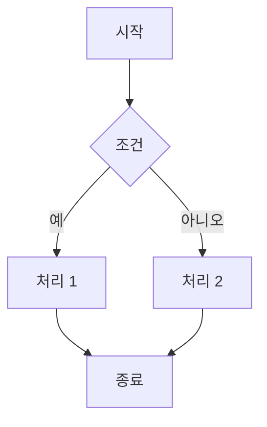

# 새김 (Saekim) - 마크다운 에디터


> 코드와 다이어그램을 자유롭게 다루는 개발자를 위한 로컬 마크다운 에디터

## 📝 프로젝트 소개

**새김(Saekim)**은 개발자와 학생을 위한 **로컬 우선(Local-First)** 마크다운 에디터입니다. 
온라인 에디터의 프라이버시 우려를 해결하고, 코드 작성과 문서화를 하나의 통합 환경에서 처리할 수 있도록 설계되었습니다.

### 개발 동기

#### 1. **프라이버시 보호**
- 기존 온라인 에디터들은 사용자 데이터를 서버에 저장하거나 분석에 활용
- 민감한 코드나 연구 노트를 안전하게 로컬 환경에서 관리 가능

#### 2. **개발자 친화적 환경**
- 코드 하이라이팅, 다이어그램, 수식을 하나의 도구로 통합
- 학습 노트, 기술 문서, API 문서 작성에 최적화
- GitHub Flavored Markdown (GFM) 호환

#### 3. **오프라인 작업**
- 인터넷 연결 없이도 모든 기능 사용 가능
- PDF/DOCX 변환도 로컬에서 처리 (외부 API 불필요)

#### 4. **오픈소스 철학**
- 모든 코드와 의존성을 투명하게 공개
- 커뮤니티 기여와 개선 가능

---

## ✨ 주요 기능

### 📄 편집 및 미리보기

#### 실시간 렌더링
- ✅ **Split View**: 편집창과 미리보기를 동시에 표시
- ✅ **자동 스크롤 동기화**: 편집 위치에 따라 미리보기 자동 이동
- ✅ **라이브 업데이트**: 입력 즉시 미리보기에 반영


- 좌우 분할 화면으로 작성과 동시에 렌더링 결과 확인
- 실시간 동기화 (300ms 디바운스)
- 스크롤 동기화 지원 (토글 가능)
- 리사이징 가능한 분할 뷰

#### 텍스트 편집


- 실행 취소/다시 실행
- 탭 키 지원 (4칸 공백 삽입)
- 커서 위치 및 선택 영역 추적
- 단어/문자 수 표시

#### 마크다운 문법 도우미

<!-- 스크린샷 삽입 위치: 마크다운 헬퍼 다이얼로그 -->

**단축키: `Ctrl+Shift+D`**

- 한글/영문 이중 검색 지원
- 볼드, 이탤릭, 취소선 등 기본 서식
- 제목 (H1~H6)
- 코드 블록 (언어 지정 가능)
- 인라인 코드
- 순서 있는/없는 리스트
- 인용구, 수평선
- 실시간 미리보기
- 원클릭 삽입

### 2. 다이어그램 지원

#### Mermaid.js 통합

<!-- 스크린샷 삽입 위치: Mermaid 다이어그램 예제 -->

**단축키: `Ctrl+Shift+M`**

지원 다이어그램 유형:
- 플로우차트 (Flowchart)
- 시퀀스 다이어그램 (Sequence Diagram)
- 상태 다이어그램 (State Diagram)
- 클래스 다이어그램 (Class Diagram)
- ER 다이어그램 (Entity Relationship)
- 파이 차트 (Pie Chart)
- 간트 차트 (Gantt Chart)

**Mermaid 헬퍼 기능:**
- 다이어그램 템플릿 제공
- 한글/영문 검색 가능
- 노드 타입별 예제 (사각형, 둥근 모서리, 원형, 다이아몬드, 육각형 등)
- 실시간 다이어그램 미리보기
- 원클릭 삽입

### 3. 수학 수식

#### KaTeX 통합

<!-- 스크린샷 삽입 위치: KaTeX 수식 렌더링 -->

**단축키: `Ctrl+Shift+K`**

- 인라인 수식: `$...$`
- 블록 수식: `$$...$$`
- 실시간 렌더링

**KaTeX 헬퍼 기능:**
- 분수, 거듭제곱, 아래첨자
- 제곱근, n제곱근
- 미적분 기호 (적분, 미분, 극한, 무한대)
- 집합론 기호
- 논리 연산자
- 그리스 문자
- 행렬 및 벡터
- 한글/영문 검색 지원
- 원클릭 삽입

### 4. 코드 구문 강조

<!-- 스크린샷 삽입 위치: 여러 언어의 코드 하이라이팅 -->

**Highlight.js 지원 언어:**
- Python
- JavaScript
- Java
- C/C++
- CSS
- JSON
- Markdown
- SQL
- Bash

**특징:**
- GitHub Dark 테마
- 자동 언어 감지
- 줄 번호 지원
- 복사 버튼 (미리보기 내)

### 5. 파일 관리

#### 다중 탭 편집

<!-- 스크린샷 삽입 위치: 다중 탭 인터페이스 -->

- 여러 파일 동시 편집
- 탭 간 손쉬운 전환
- 드래그 앤 드롭으로 탭 재정렬
- 미저장 파일 표시 (*)
- `Ctrl+W`로 탭 닫기
- 세션 복원 (앱 재시작 시 이전 탭 복구)

#### 파일 탐색기

<!-- 스크린샷 삽입 위치: 파일 탐색기 사이드바 -->

- 좌측 사이드바에 디렉토리 트리 표시
- 폴더 열기 및 탐색
- 더블클릭으로 파일 열기
- 현재 파일 강조 표시
- 탐색기 경로 자동 저장
- 토글 가능한 사이드바

#### 파일 작업

<!-- 스크린샷 삽입 위치: 파일 열기/저장 다이얼로그 -->

- 파일 열기 (`.md`, `.txt`, `.markdown`)
- 새 파일 생성
- 저장 (`Ctrl+S`)
- 다른 이름으로 저장
- 파일 정보 표시 (이름, 크기, 경로, 수정 날짜)
- 수정 상태 추적

### 6. 문서 변환

#### PDF 내보내기

<!-- 스크린샷 삽입 위치: PDF 내보내기 진행 상황 -->

**Playwright 기반 고품질 PDF 생성:**
- 미리보기와 동일한 렌더링 결과
- Mermaid 다이어그램 완벽 지원
- KaTeX 수식 정확한 렌더링
- A4 용지 크기 자동 조정
- 커스텀 여백 (2.5cm)
- 헤더/푸터 및 페이지 번호
- 실시간 진행률 표시
- GTK3 의존성 불필요 (간편한 설치)

#### DOCX 내보내기

<!-- 스크린샷 삽입 위치: DOCX 변환 결과 -->

- Microsoft Word 형식 (`.docx`) 생성
- 제목 레벨 보존
- 기본 단락 서식 유지
- python-docx 라이브러리 활용

#### HTML 내보내기

<!-- 스크린샷 삽입 위치: HTML 내보내기 -->

- 독립 실행형 HTML 파일 생성
- 스타일 임베디드
- 마크다운 → HTML 변환
- 브라우저에서 바로 열람 가능

#### PDF → Markdown 변환

<!-- 스크린샷 삽입 위치: PDF 임포트 -->

**고급 구조 인식:**
- 폰트 크기 기반 제목 감지
- 볼드/이탤릭 텍스트 감지
- 코드 블록 자동 인식 (고정폭 폰트)
- 테이블 추출 (pdfplumber)
- 이미지 추출 및 자동 정리
- 리스트 항목 감지
- 다중 페이지 문서 처리
- 헤더/푸터 필터링
- 중복 이미지 제거 (로고 중복 방지)

**사용 라이브러리:**
- PyMuPDF (fitz) - 주 텍스트/이미지 추출
- pdfplumber - 테이블 추출 폴백

### 7. 찾기 및 바꾸기

<!-- 스크린샷 삽입 위치: 찾기 및 바꾸기 다이얼로그 -->

**단축키: `Ctrl+F`**

**기능:**
- VS Code 스타일 인라인 위젯
- 실시간 검색 결과 하이라이트
- 대소문자 구분 옵션 (`Alt+C`)
- 전체 단어 일치 옵션 (`Alt+W`)
- 정규 표현식 지원 (`Alt+R`)
- 검색 결과 개수 표시
- 이전/다음 결과 탐색
- 단일 항목 바꾸기
- 전체 바꾸기
- 하이라이트 백드롭
- `Escape`로 닫기

### 8. 이미지 관리

<!-- 스크린샷 삽입 위치: 이미지 삽입 -->

**이미지 삽입 기능:**
- 파일 다이얼로그에서 이미지 선택
- 자동 경로 관리:
  - 저장된 파일: `{filename}_images/` 폴더에 복사
  - 미저장 파일: `data/temp/images/` 임시 폴더
- 파일명 충돌 자동 처리
- 상대 경로 자동 계산
- 파일 저장 시 자동 이동
- 미리보기에서 즉시 렌더링

### 9. 테마 및 UI/UX

#### 라이트/다크 테마

<!-- 스크린샷 삽입 위치: 라이트 테마 -->
<!-- 스크린샷 삽입 위치: 다크 테마 -->

- 두 가지 테마 지원
- 테마 설정 저장 (QSettings)
- 실시간 테마 전환
- SVG 아이콘 색상 자동 조정
- Python 백엔드 + JavaScript 프론트엔드 통합 테마 시스템

#### 사용자 인터페이스

<!-- 스크린샷 삽입 위치: 메인 UI 전체 화면 -->

- 프레임리스 커스텀 타이틀바 (Windows Aero Snap 지원)
- 네이티브 윈도우 리사이징
- 편집기 전용 툴바:
  - 실행 취소/다시 실행
  - 이미지 삽입
  - 표 삽입
  - 마크다운 도우미 (MD)
  - KaTeX 도우미 (fx)
  - Mermaid 도우미 (◇)
  - 찾기
  - 스크롤 동기화
- 상태 표시줄:
  - 단어 수
  - 문자 수
  - 커서 위치 (행:열)
- PDF 변환 진행률 모달

#### 환영 화면

<!-- 스크린샷 삽입 위치: 환영 화면 -->

- 첫 실행 시 표시
- 빠른 액션 버튼:
  - 폴더 열기
  - 파일 열기
  - 새 파일
- 동적 테마 스타일링

#### 설정

<!-- 스크린샷 삽입 위치: 설정 다이얼로그 -->

- 사용자 설정 다이얼로그
- 폰트 크기 조정
- 레이아웃 설정
- 테마 선택
- localStorage 및 QSettings에 저장

### 10. 단축키

| 단축키 | 기능 |
|--------|------|
| `Ctrl+F` | 찾기 및 바꾸기 |
| `Ctrl+Z` | 실행 취소 |
| `Ctrl+Y` | 다시 실행 |
| `Ctrl+S` | 저장 |
| `Ctrl+W` | 탭 닫기 |
| `Ctrl+=` / `Ctrl++` | 폰트 크기 증가 |
| `Ctrl+-` | 폰트 크기 감소 |
| `Ctrl+0` | 폰트 크기 초기화 |
| `Ctrl+Shift+D` | 마크다운 문법 도우미 |
| `Ctrl+Shift+K` | KaTeX 수식 도우미 |
| `Ctrl+Shift+M` | Mermaid 다이어그램 도우미 |
| `Tab` | 들여쓰기 삽입 |
| `Escape` | 다이얼로그 닫기 |

---

## 설치 방법

### 시스템 요구사항

- **운영 체제**: Windows 10/11, macOS 10.15+, Linux
- **Python**: 3.10 이상
- **RAM**: 4GB 이상 권장
- **디스크 공간**: 500MB 이상

### 의존성 설치

#### 1. Python 설치

Python 3.10 이상이 설치되어 있어야 합니다.

- [Python 공식 웹사이트](https://www.python.org/downloads/)에서 다운로드

#### 2. 저장소 클론

```bash
git clone https://github.com/beeean17/Saekim.git
cd Saekim
```

#### 3. 가상환경 생성 및 활성화

**Windows:**
```bash
python -m venv venv
venv\Scripts\activate
```

**macOS/Linux:**
```bash
python3 -m venv venv
source venv/bin/activate
```

#### 4. 필수 패키지 설치

```bash
pip install -r requirements.txt
```

#### 5. Playwright 설정 (PDF 변환 기능 사용 시)

PDF 내보내기 기능을 사용하려면 Playwright 브라우저를 설치해야 합니다:

```bash
playwright install chromium
```

> **참고**: Playwright 설치 없이도 애플리케이션은 정상 작동하지만, PDF 내보내기 기능은 사용할 수 없습니다.

### 애플리케이션 실행

```bash
python src/main.py
```

---

## 사용법

### 기본 사용법

#### 1. 새 파일 생성

<!-- 스크린샷 삽입 위치: 새 파일 생성 -->

- 환영 화면에서 "새 파일" 버튼 클릭
- 또는 파일 탐색기에서 폴더 열기 후 새 파일 생성

#### 2. 파일 열기

<!-- 스크린샷 삽입 위치: 파일 열기 -->

- 환영 화면에서 "파일 열기" 또는 "폴더 열기" 버튼 클릭
- 파일 탐색기에서 파일 더블클릭

#### 3. 마크다운 작성

<!-- 스크린샷 삽입 위치: 마크다운 작성 -->

- 좌측 에디터에 마크다운 작성
- 우측 미리보기에서 실시간 렌더링 확인
- 마크다운 문법이 익숙하지 않다면 `Ctrl+Shift+D`로 도우미 열기

#### 4. 다이어그램 삽입

<!-- 스크린샷 삽입 위치: 다이어그램 삽입 과정 -->

**Mermaid 다이어그램:**
```markdown

```

- 또는 `Ctrl+Shift+M`으로 Mermaid 헬퍼 열어서 템플릿 선택

#### 5. 수식 삽입

<!-- 스크린샷 삽입 위치: 수식 삽입 -->

**인라인 수식:**
```markdown
이차방정식의 근의 공식은 $x = \frac{-b \pm \sqrt{b^2-4ac}}{2a}$ 입니다.
```

**블록 수식:**
```markdown
$$
\int_{a}^{b} f(x) \, dx = F(b) - F(a)
$$
```

- 또는 `Ctrl+Shift+K`로 KaTeX 헬퍼 열어서 수식 템플릿 선택

#### 6. 이미지 삽입

<!-- 스크린샷 삽입 위치: 이미지 삽입 -->

- 툴바에서 이미지 삽입 버튼 클릭
- 파일 선택 다이얼로그에서 이미지 선택
- 자동으로 마크다운 문법 삽입 및 파일 복사

#### 7. 파일 저장

<!-- 스크린샷 삽입 위치: 파일 저장 -->

- `Ctrl+S` 또는 메뉴에서 저장 선택
- 새 파일의 경우 저장 위치 선택

#### 8. PDF로 내보내기

<!-- 스크린샷 삽입 위치: PDF 내보내기 -->

- 메뉴에서 "PDF로 내보내기" 선택
- 저장 위치 선택
- 진행률 모달에서 변환 과정 확인

#### 9. PDF를 마크다운으로 변환

<!-- 스크린샷 삽입 위치: PDF 임포트 -->

- 메뉴에서 "PDF 가져오기" 선택
- PDF 파일 선택
- 변환된 마크다운이 새 탭에 열림

### 고급 사용법

#### 다중 탭 활용

<!-- 스크린샷 삽입 위치: 다중 탭 작업 -->

- 여러 파일을 동시에 열어 작업
- 드래그 앤 드롭으로 탭 순서 변경
- `Ctrl+W`로 현재 탭 닫기

#### 찾기 및 바꾸기

<!-- 스크린샷 삽입 위치: 찾기 바꾸기 사용 -->

- `Ctrl+F`로 찾기 위젯 열기
- 검색어 입력 후 `Enter`로 다음 결과, `Shift+Enter`로 이전 결과
- 정규 표현식으로 고급 검색
- 전체 바꾸기로 일괄 수정

#### 테마 전환

<!-- 스크린샷 삽입 위치: 테마 전환 -->

- 설정에서 라이트/다크 테마 선택
- 선택한 테마는 자동으로 저장됨

#### 세션 복원

- 애플리케이션 종료 시 열려있던 탭 자동 저장
- 재시작 시 이전 세션 자동 복원

---

## 스크린샷

### 메인 인터페이스

<!-- 전체 화면 스크린샷 -->


### 라이트 테마

<!-- 라이트 테마 스크린샷 -->


### 다크 테마

<!-- 다크 테마 스크린샷 -->


### 코드 구문 강조

<!-- 코드 하이라이팅 스크린샷 -->


### Mermaid 다이어그램

<!-- Mermaid 다이어그램 스크린샷 -->


### KaTeX 수학 수식

<!-- KaTeX 수식 스크린샷 -->


### 마크다운 도우미

<!-- 마크다운 헬퍼 스크린샷 -->


### Mermaid 도우미

<!-- Mermaid 헬퍼 스크린샷 -->


### KaTeX 도우미

<!-- KaTeX 헬퍼 스크린샷 -->


### 찾기 및 바꾸기

<!-- 찾기 바꾸기 스크린샷 -->


### 파일 탐색기

<!-- 파일 탐색기 스크린샷 -->


### PDF 내보내기 진행률

<!-- PDF 진행률 스크린샷 -->


### PDF → Markdown 변환

<!-- PDF 임포트 결과 스크린샷 -->


### 환영 화면

<!-- 환영 화면 스크린샷 -->


---

## 기술 스택

### 프론트엔드

| 기술 | 용도 | 라이선스 |
|------|------|----------|
| **PyQt6** | GUI 프레임워크 | GPL-3.0 |
| **PyQt6-WebEngine** | Chromium 기반 웹 렌더링 | GPL-3.0 |
| **marked.js** | 마크다운 파싱 | MIT |
| **DOMPurify** | HTML 새니타이제이션 (XSS 방지) | Apache 2.0 / MPL 2.0 |
| **Highlight.js** | 코드 구문 강조 | BSD 3-Clause |
| **Mermaid.js** | 다이어그램 렌더링 | MIT |
| **KaTeX** | 수학 수식 렌더링 | MIT |
| **QWebChannel** | Python-JavaScript 브릿지 | LGPL-3.0 |

### 백엔드

| 기술 | 용도 | 라이선스 |
|------|------|----------|
| **Python 3.10+** | 주 개발 언어 | PSF |
| **PyQt6** | 데스크톱 애플리케이션 프레임워크 | GPL-3.0 |
| **python-docx** | DOCX 파일 생성 | MIT |
| **Playwright** | PDF 생성 (HTML → PDF) | Apache 2.0 |
| **PyMuPDF (fitz)** | PDF 텍스트/이미지 추출 | AGPL-3.0 |
| **pdfplumber** | PDF 테이블 추출 | MIT |
| **PyPDF2** | PDF 메타데이터 추출 | BSD 3-Clause |
| **Pillow** | 이미지 처리 | HPND |
| **beautifulsoup4** | HTML/XML 파싱 | MIT |
| **lxml** | 고속 XML/HTML 파싱 | BSD 3-Clause |
| **python-dateutil** | 날짜/시간 유틸리티 | Apache 2.0 / BSD 3-Clause |

### 개발 도구

| 도구 | 용도 | 라이선스 |
|------|------|----------|
| **pytest** | 테스팅 프레임워크 | MIT |
| **pytest-cov** | 코드 커버리지 | MIT |
| **pytest-qt** | PyQt 테스팅 | MIT |
| **black** | 코드 포맷터 | MIT |
| **pylint** | 정적 분석 | GPL-2.0 |
| **mypy** | 타입 체커 | MIT |
| **flake8** | 스타일 가이드 검사 | MIT |
| **sphinx** | 문서 생성 | BSD 2-Clause |

자세한 라이선스 정보는 [LICENSES.md](Licenses/LICENSES.md)를 참조하세요.

---

## 프로젝트 구조

```
Saekim/
├── src/
│   ├── main.py                    # 애플리케이션 진입점
│   ├── backend/
│   │   ├── api.py                 # QWebChannel API 백엔드
│   │   ├── converter.py           # 문서 변환 모듈 (PDF, DOCX, HTML)
│   │   ├── tab_manager.py         # 탭 관리
│   │   └── session_manager.py     # 세션 관리 및 복원
│   ├── ui/
│   │   ├── index.html             # 메인 웹뷰 HTML
│   │   ├── welcome.html           # 환영 화면 HTML
│   │   ├── css/                   # 스타일시트
│   │   │   ├── app.css
│   │   │   ├── editor.css
│   │   │   ├── preview.css
│   │   │   ├── dialogs.css
│   │   │   ├── theme-dark.css
│   │   │   └── theme-light.css
│   │   └── js/                    # JavaScript 모듈
│   │       ├── app.js             # 메인 앱 로직
│   │       ├── editor.js          # 에디터 기능
│   │       ├── preview.js         # 미리보기 렌더링
│   │       ├── file.js            # 파일 관리
│   │       ├── toolbar.js         # 툴바 액션
│   │       ├── theme.js           # 테마 전환
│   │       ├── settings.js        # 설정 관리
│   │       ├── find-replace.js    # 찾기 및 바꾸기
│   │       ├── markdown-helper.js # 마크다운 도우미
│   │       ├── katex-helper.js    # KaTeX 도우미
│   │       ├── mermaid-helper.js  # Mermaid 도우미
│   │       └── utils.js           # 유틸리티 함수
│   ├── windows/
│   │   └── main_window.py         # 메인 윈도우 (QMainWindow)
│   ├── utils/
│   │   ├── logger.py              # 로깅 시스템
│   │   ├── theme_manager.py       # 테마 관리
│   │   └── design_manager.py      # 디자인 리소스 관리
│   └── resources/                 # 리소스 파일
│       ├── icons/                 # SVG 아이콘
│       └── themes/                # QSS 테마 파일
├── data/
│   ├── temp/                      # 임시 파일 (미저장 이미지 등)
│   └── sessions/                  # 세션 저장 파일
├── Licenses/
│   ├── LICENSE                    # GPL-3.0 라이선스
│   └── LICENSES.md                # 서드파티 라이선스 정보
├── docs/
│   └── images/                    # README 스크린샷
├── requirements.txt               # Python 의존성
└── README.md                      # 프로젝트 문서
```

---

## 개발 가이드

### 개발 환경 설정

#### 1. 저장소 포크 및 클론

```bash
git clone https://github.com/yourusername/Saekim.git
cd Saekim
```

#### 2. 개발 의존성 설치

```bash
pip install -r requirements.txt
# 개발 도구 (선택)
pip install pytest pytest-cov pytest-qt black pylint mypy flake8
```

#### 3. 애플리케이션 실행

```bash
python src/main.py
```

### 코드 스타일

이 프로젝트는 다음 코드 스타일 가이드를 따릅니다:

- **Python**: PEP 8
- **JavaScript**: Airbnb JavaScript Style Guide
- **포맷터**: Black (Python), Prettier (JavaScript)

```bash
# Python 코드 포맷
black src/

# Linting
pylint src/
flake8 src/

# 타입 체크
mypy src/
```

### 테스트

```bash
# 모든 테스트 실행
pytest

# 커버리지 리포트
pytest --cov=src --cov-report=html
```

### 기여 워크플로우

1. **이슈 생성**: 버그 리포트 또는 기능 제안
2. **브랜치 생성**: `feature/your-feature-name` 또는 `fix/bug-description`
3. **코드 작성**: 기능 구현 또는 버그 수정
4. **테스트 추가**: 새로운 기능에 대한 테스트 작성
5. **커밋**: 명확한 커밋 메시지 작성
6. **풀 리퀘스트**: 메인 브랜치로 PR 생성

### 커밋 메시지 컨벤션

```
feat: 새로운 기능 추가
fix: 버그 수정
docs: 문서 수정
style: 코드 포맷팅 (기능 변경 없음)
refactor: 코드 리팩토링
test: 테스트 추가 또는 수정
chore: 빌드 프로세스 또는 도구 변경
```

---

## 라이선스

이 프로젝트는 **GNU General Public License v3.0 (GPL-3.0)** 하에 배포됩니다.

### 주요 사항

- **이유**: 이 프로젝트는 PyQt6를 사용하며, PyQt6는 GPL-3.0 라이선스를 따릅니다. 따라서 본 프로젝트도 GPL-3.0을 준수해야 합니다.
- **오픈소스 요구사항**: GPL-3.0에 따라, 이 소프트웨어의 소스 코드는 공개적으로 이용 가능해야 하며, 수정 및 재배포 시에도 동일한 라이선스를 적용해야 합니다.
- **상업적 사용**: 상업적/독점적 사용을 원하는 경우, PyQt6 대신 **PySide6** (LGPL-3.0 라이선스)로 마이그레이션하거나, Qt Company로부터 상업 라이선스를 구매해야 합니다.

### 서드파티 라이선스

이 프로젝트는 다음 오픈소스 라이브러리를 사용합니다 (총 25개):

#### Python 라이브러리 (11개)
- **GPL-3.0**: PyQt6 (#1), PyQt6-WebEngine (#2)
- **Apache 2.0**: Playwright (#3)
- **MIT**: pdfplumber (#4), python-docx (#7), beautifulsoup4 (#9)
- **BSD 3-Clause**: PyPDF2 (#5), lxml (#10)
- **AGPL-3.0**: PyMuPDF (#6) - Enhanced PDF to Markdown conversion
- **HPND**: Pillow (#8)
- **Apache 2.0 / BSD 3-Clause**: python-dateutil (#11)

#### JavaScript 라이브러리 (6개)
- **MIT**: CodeMirror 6 (#20), Marked.js (#21), Mermaid.js (#23), KaTeX (#24)
- **BSD 3-Clause**: Highlight.js (#22)
- **Apache 2.0 / MPL 2.0**: DOMPurify (#25)

#### 개발 도구 (8개)
- **MIT**: pytest (#12), pytest-cov (#13), pytest-qt (#14), black (#15), mypy (#17), flake8 (#18)
- **GPL-2.0**: pylint (#16)
- **BSD 2-Clause**: sphinx (#19)

**중요**: PyMuPDF는 AGPL-3.0 라이선스이지만 GPL-3.0과 호환됩니다. 모든 라이브러리는 본 프로젝트의 GPL-3.0 라이선스와 호환됩니다.

자세한 내용은 [LICENSE](Licenses/LICENSE) 및 [LICENSES.md](Licenses/LICENSES.md)를 참조하세요.

---

## 기여하기

**새김**은 오픈소스 프로젝트이며, 여러분의 기여를 환영합니다!

### 기여 방법

1. **버그 리포트**: [Issues](https://github.com/beeean17/Saekim/issues)에서 버그 리포트 작성
2. **기능 제안**: 새로운 기능에 대한 아이디어 공유
3. **코드 기여**: Pull Request를 통해 코드 기여
4. **문서 개선**: README, 주석, 문서 개선

### 기여 가이드라인

- 코드 스타일 가이드를 따라주세요
- 모든 새로운 기능에 대해 테스트를 작성해주세요
- 커밋 메시지는 명확하고 간결하게 작성해주세요
- Pull Request 시 변경 사항을 상세히 설명해주세요

### 행동 강령

이 프로젝트는 [Contributor Covenant Code of Conduct](https://www.contributor-covenant.org/)를 따릅니다. 참여함으로써 여러분은 이 강령을 준수하는 데 동의합니다.

---

## 문의 및 지원

### 버그 리포트 및 기능 요청

- **GitHub Issues**: [https://github.com/beeean17/Saekim/issues](https://github.com/beeean17/Saekim/issues)

### 자주 묻는 질문 (FAQ)

**Q: PDF 변환이 작동하지 않습니다.**
A: Playwright Chromium이 설치되어 있는지 확인하세요: `playwright install chromium`

**Q: PyQt6 대신 PySide6를 사용할 수 있나요?**
A: 네, PySide6는 LGPL-3.0 라이선스로 상업적 사용에 더 유연합니다. 마이그레이션이 필요합니다.

**Q: 다른 마크다운 에디터와의 차이점은?**
A: 새김은 로컬 우선, 개발자 친화적, PDF 양방향 변환, 한글 지원에 중점을 둡니다.

**Q: 자동 저장 주기를 변경할 수 있나요?**
A: 현재는 300ms 디바운스로 고정되어 있으나, 설정 기능 추가 예정입니다.

**Q: 모바일 버전이 있나요?**
A: 현재는 데스크톱 전용이며, 모바일 지원은 향후 계획에 있습니다.

### 커뮤니티

- **프로젝트 저장소**: [https://github.com/beeean17/Saekim](https://github.com/beeean17/Saekim)
- **이슈 트래커**: [https://github.com/beeean17/Saekim/issues](https://github.com/beeean17/Saekim/issues)

---

## 감사의 말

이 프로젝트는 다음 오픈소스 프로젝트들 덕분에 가능했습니다:

- [PyQt6](https://www.riverbankcomputing.com/software/pyqt/) - GUI 프레임워크
- [Marked.js](https://marked.js.org/) - 마크다운 파서
- [Mermaid.js](https://mermaid.js.org/) - 다이어그램 생성
- [KaTeX](https://katex.org/) - 수학 수식 렌더링
- [Highlight.js](https://highlightjs.org/) - 코드 구문 강조
- [Playwright](https://playwright.dev/) - PDF 생성
- [PyMuPDF](https://pymupdf.readthedocs.io/) - PDF 처리
- 그 외 모든 서드파티 라이브러리 기여자분들께 감사드립니다

---

## 로드맵

### 현재 버전 (v1.0.0)

- ✅ 기본 마크다운 편집
- ✅ 실시간 미리보기
- ✅ 코드 구문 강조
- ✅ Mermaid 다이어그램
- ✅ KaTeX 수식
- ✅ PDF/DOCX/HTML 내보내기
- ✅ PDF → Markdown 변환
- ✅ 다중 탭 지원
- ✅ 파일 탐색기
- ✅ 찾기 및 바꾸기
- ✅ 라이트/다크 테마

### 향후 계획 (v2.0.0)

- 🔄 Git 통합
- 🔄 플러그인 시스템
- 🔄 클라우드 동기화 (선택적)
- 🔄 협업 기능
- 🔄 Vim/Emacs 키바인딩
- 🔄 커스텀 CSS 지원
- 🔄 목차 자동 생성
- 🔄 표 편집기
- 🔄 스펠 체크
- 🔄 다국어 지원 (영어, 일본어)

---

<p align="center">
  Made with ❤️ by the Saekim Team
</p>

<p align="center">
  <a href="https://github.com/beeean17/Saekim">⭐ Star us on GitHub</a> •
  <a href="https://github.com/beeean17/Saekim/issues">🐛 Report Bug</a> •
  <a href="https://github.com/beeean17/Saekim/issues">💡 Request Feature</a>
</p>
