# Mermaid 다이어그램 테스트 예제 모음

## 1. 플로우차트 (Flowchart)

### 간단한 플로우차트
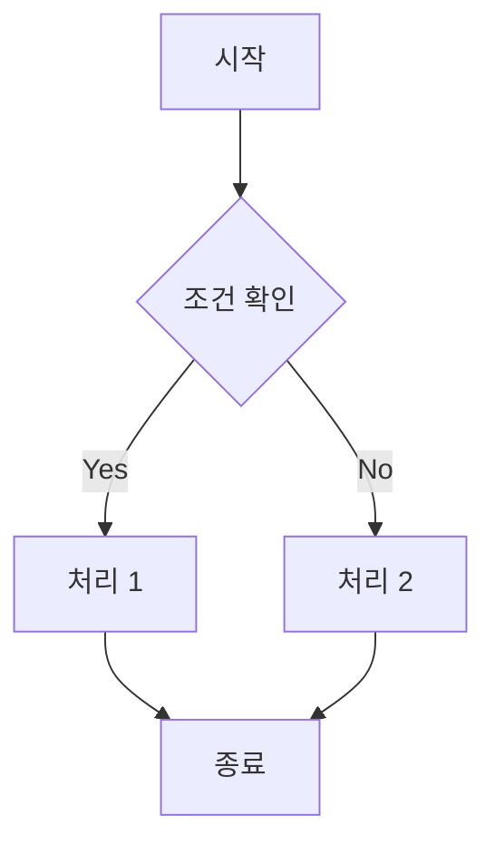

### 복잡한 플로우차트
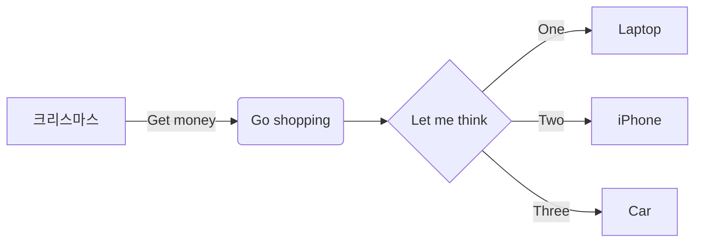

## 2. 시퀀스 다이어그램 (Sequence Diagram)

### 로그인 시퀀스
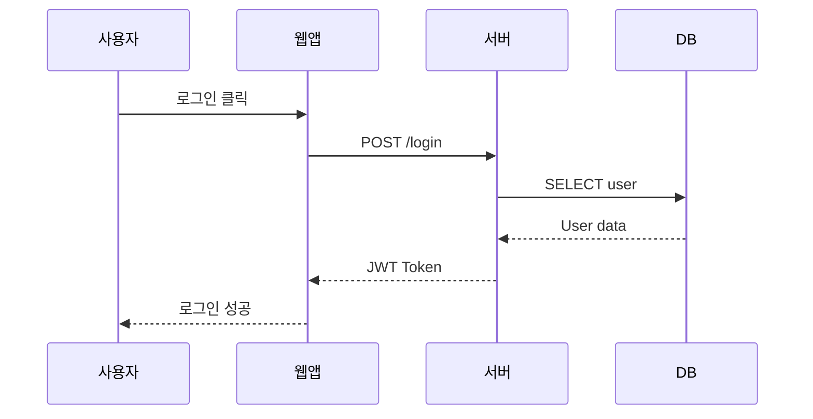

### 주문 처리 시퀀스
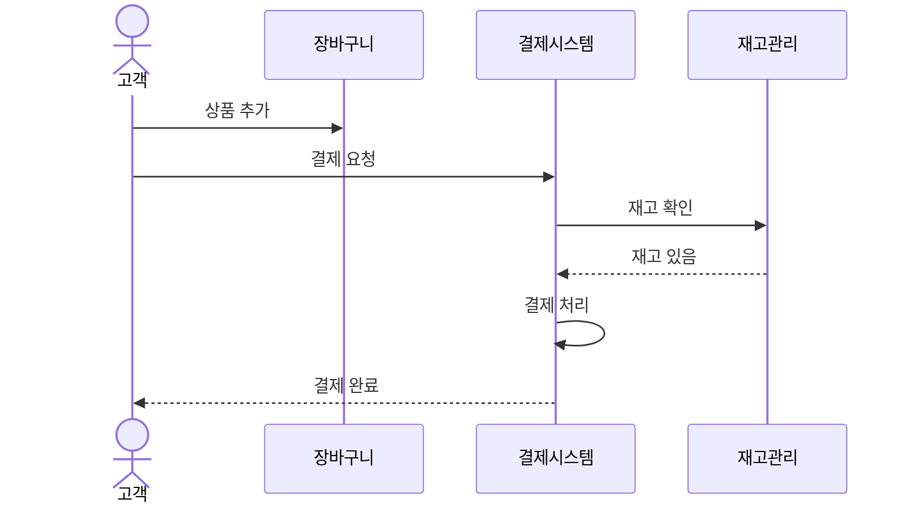

## 3. 클래스 다이어그램 (Class Diagram)

### 간단한 클래스 구조
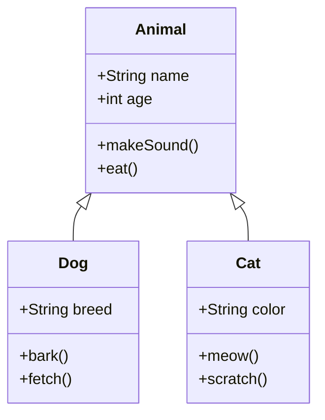

### 상세한 클래스 다이어그램
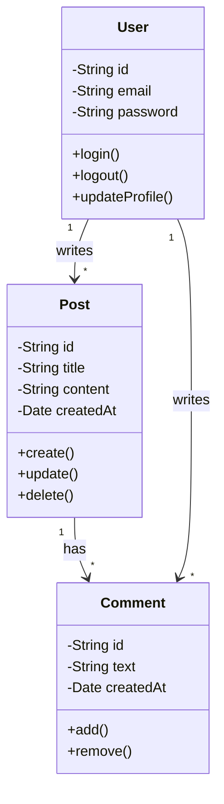

## 4. 상태 다이어그램 (State Diagram)

### 주문 상태
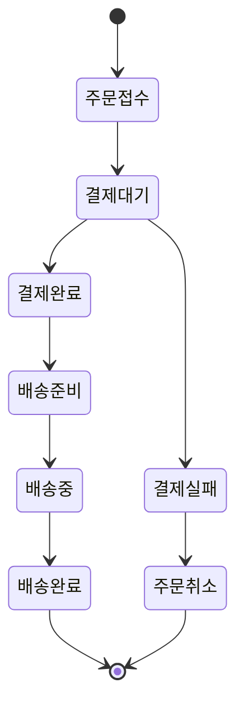

### 로그인 상태
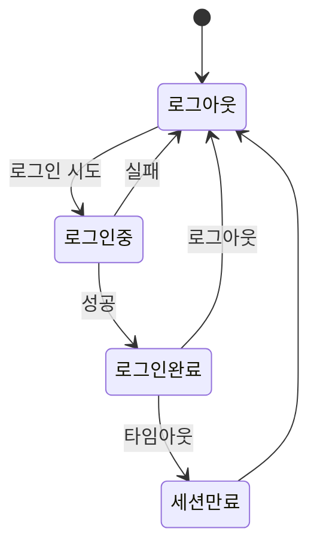

## 5. ER 다이어그램 (Entity Relationship)

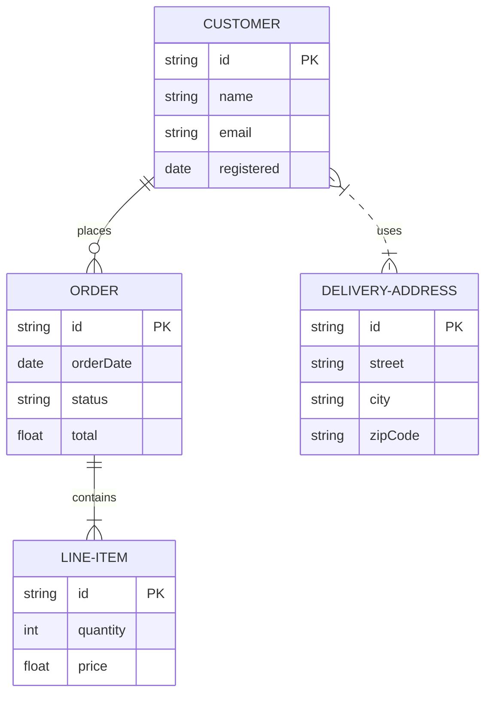

## 6. 간트 차트 (Gantt Chart)

### 프로젝트 일정
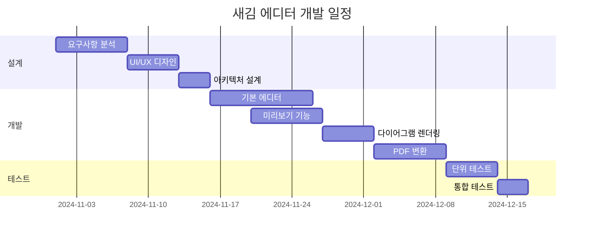

### 스프린트 계획
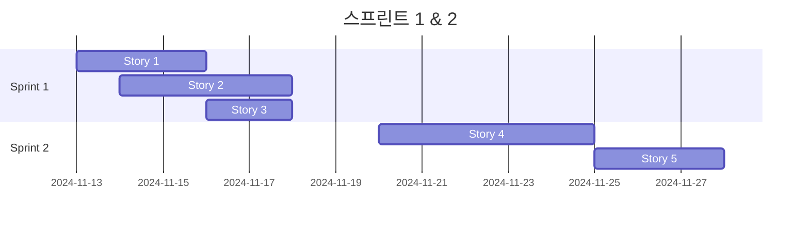

## 7. 파이 차트 (Pie Chart)

### 프로그래밍 언어 사용 비율
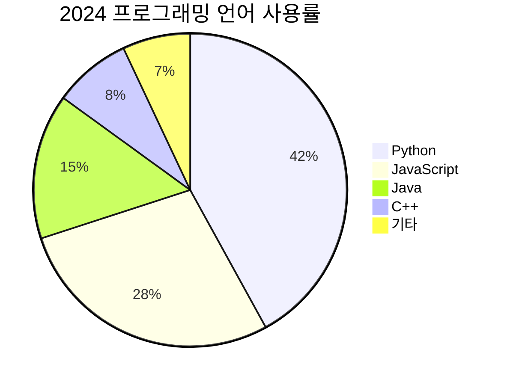

### 프로젝트 시간 분배
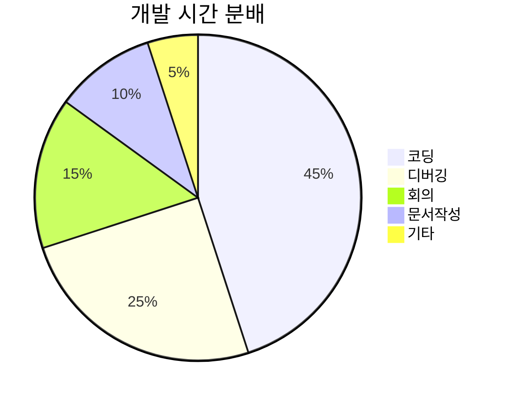

## 8. 타임라인 (Git Graph)

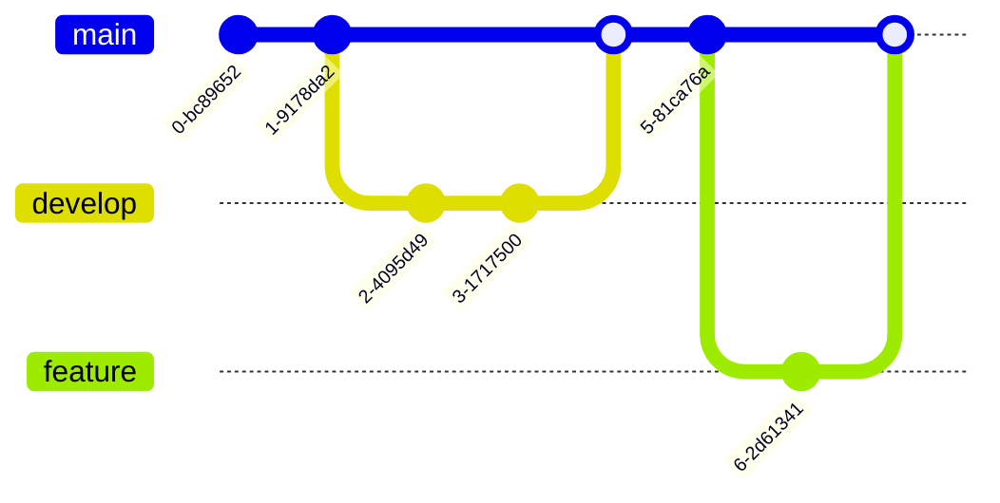

## 9. 마인드맵 (Mind Map)

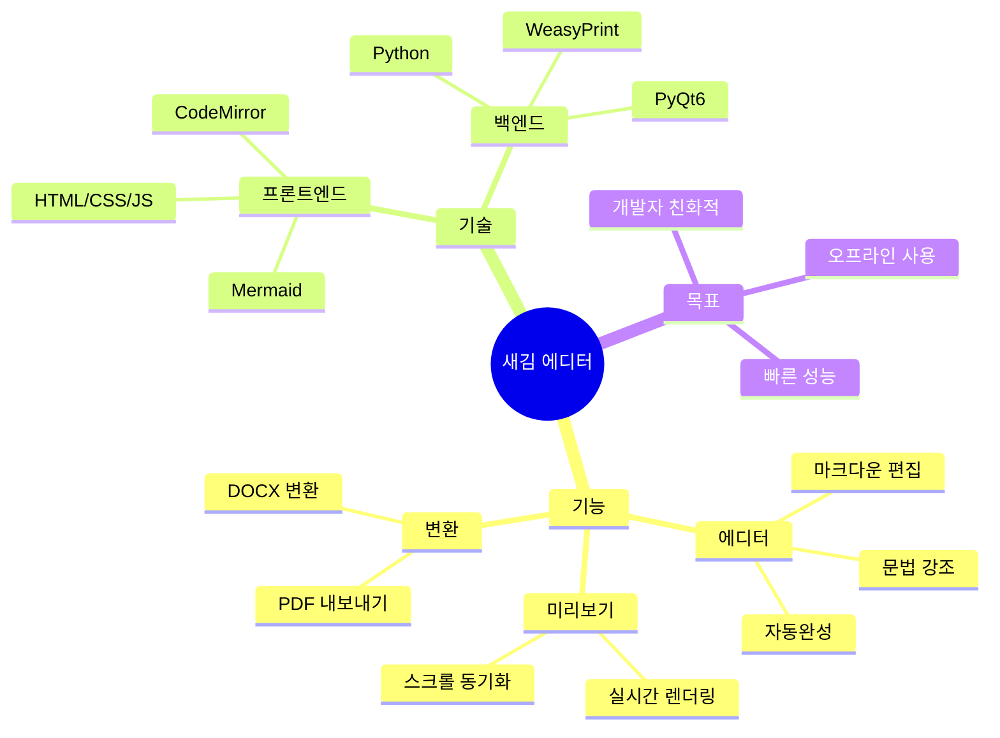

## 10. 요구사항 다이어그램

```mermaid
requirementDiagram
    requirement 마크다운편집 {
        id: 1
        text: 사용자는 마크다운을 편집할 수 있어야 한다
        risk: high
        verifymethod: test
    }
    requirement 실시간미리보기 {
        id: 2
        text: 입력 즉시 미리보기가 업데이트되어야 한다
        risk: medium
        verifymethod: inspection
    }
    requirement PDF변환 {
        id: 3
        text: 마크다운을 PDF로 변환할 수 있어야 한다
        risk: low
        verifymethod: demonstration
    }
    마크다운편집 - satisfies -> 실시간미리보기
    마크다운편집 - refines -> PDF변환
```

## 11. 사용자 여정 (User Journey)

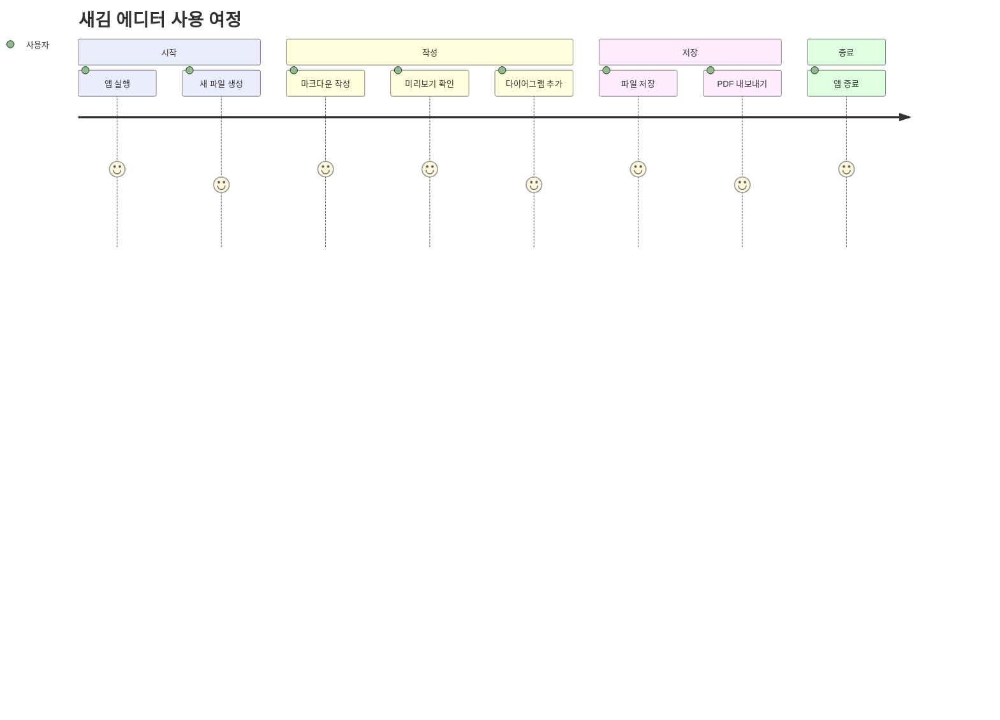

---

## 테스트 방법

1. 위의 코드 블록을 하나씩 복사해서 에디터에 붙여넣기
2. 오른쪽 미리보기에서 다이어그램이 렌더링되는지 확인
3. 터미널에서 `[JS Console]` 메시지 확인
4. 문제가 있으면 에러 메시지 복사해서 공유

## 예상 결과

각 다이어그램이 깔끔하게 렌더링되어야 하며, 터미널에는:
- `🔍 Found X Mermaid code blocks`
- `✅ Rendered X Mermaid diagrams`

이런 메시지가 나타나야 합니다.


