# Mermaid 다이어그램 테스트 예제 모음 (수정본)

## 1. 플로우차트 (Flowchart)

### 간단한 플로우차트
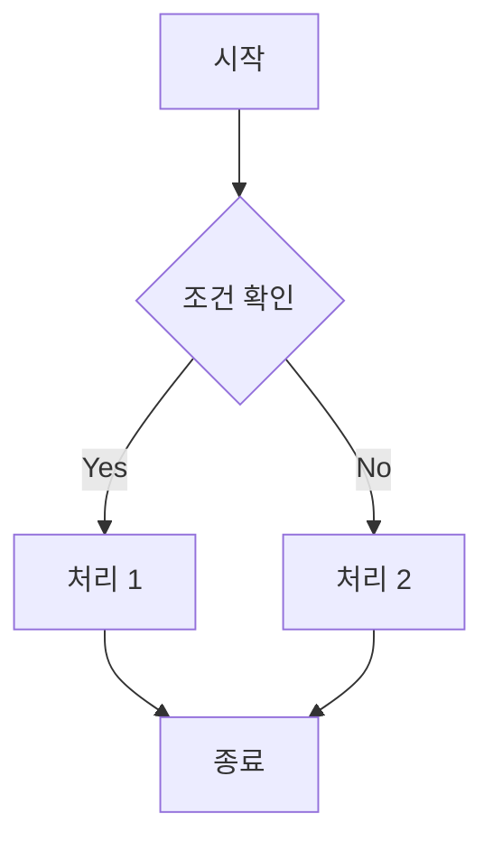

### 복잡한 플로우차트
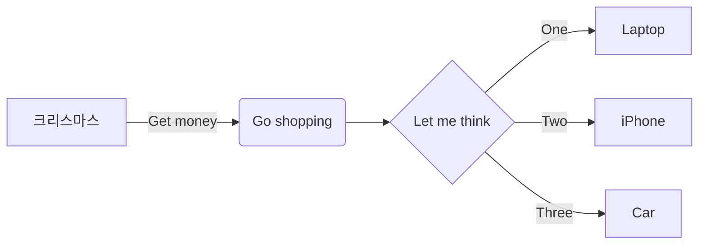

## 2. 시퀀스 다이어그램 (Sequence Diagram)

### 로그인 시퀀스
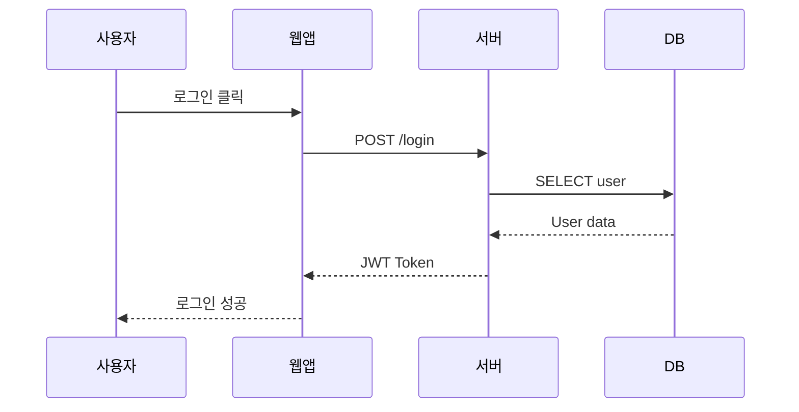

### 주문 처리 시퀀스
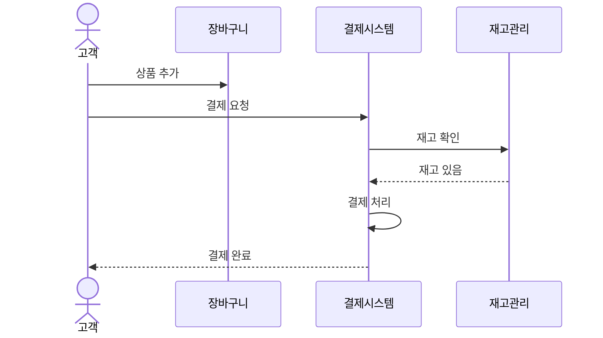

## 3. 클래스 다이어그램 (Class Diagram)

### 간단한 클래스 구조
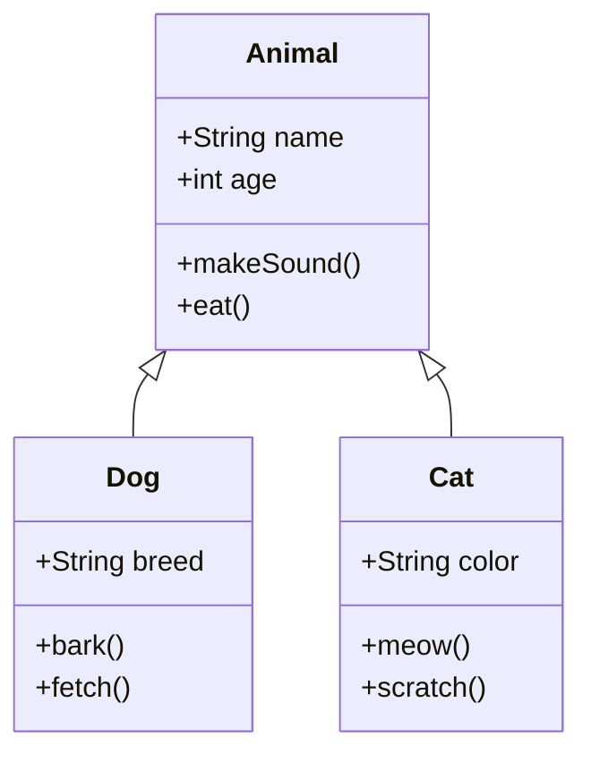

### 상세한 클래스 다이어그램
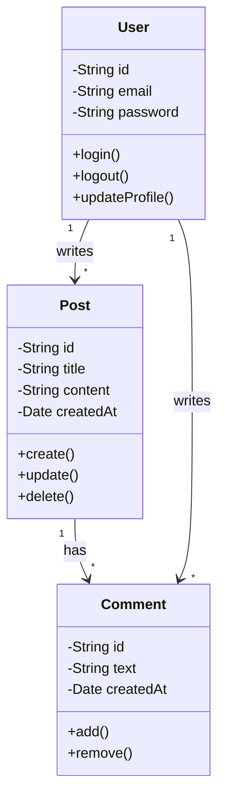

## 4. 상태 다이어그램 (State Diagram)

### 주문 상태
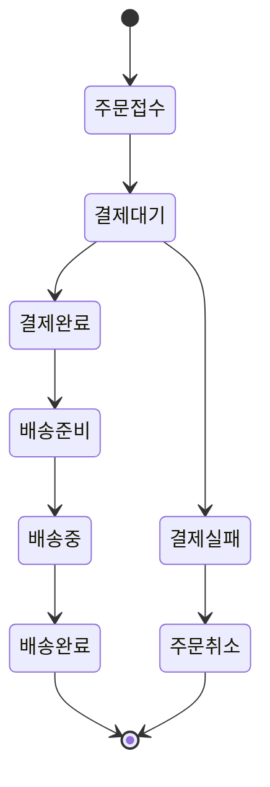

### 로그인 상태
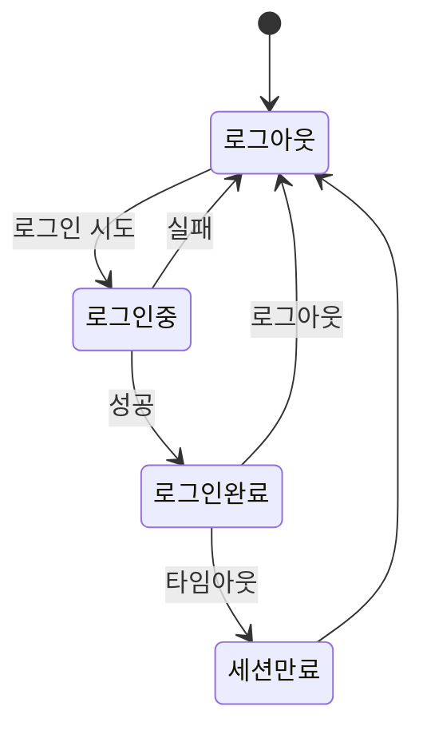

## 5. ER 다이어그램 (Entity Relationship)

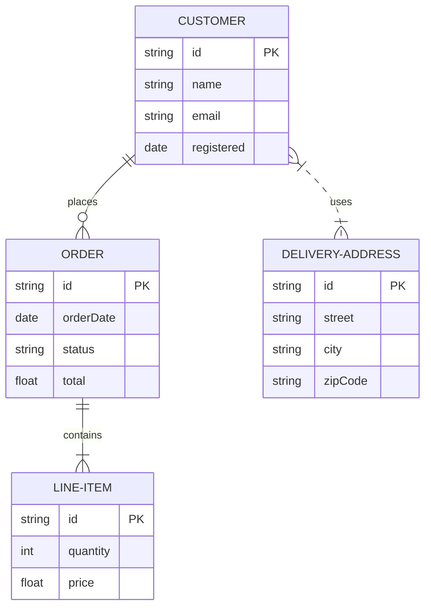

## 6. 간트 차트 (Gantt Chart)

### 프로젝트 일정
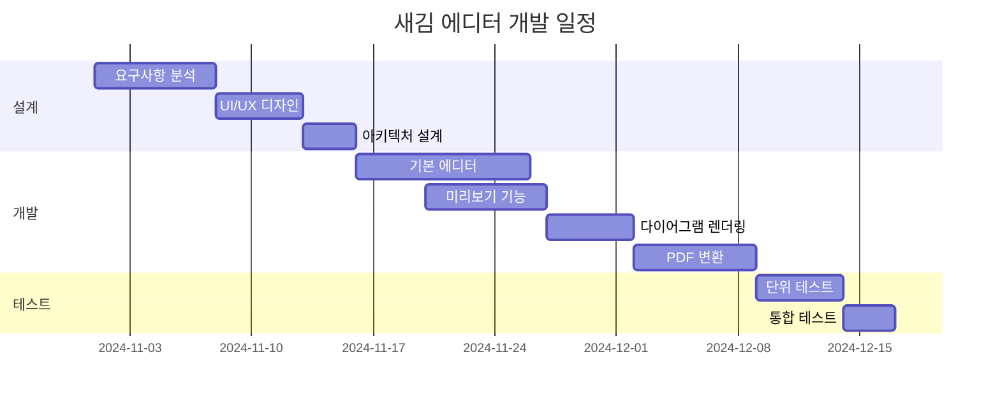

### 스프린트 계획
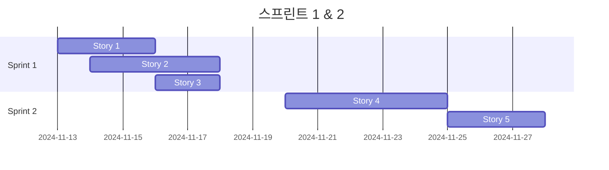

## 7. 파이 차트 (Pie Chart)

### 프로그래밍 언어 사용 비율
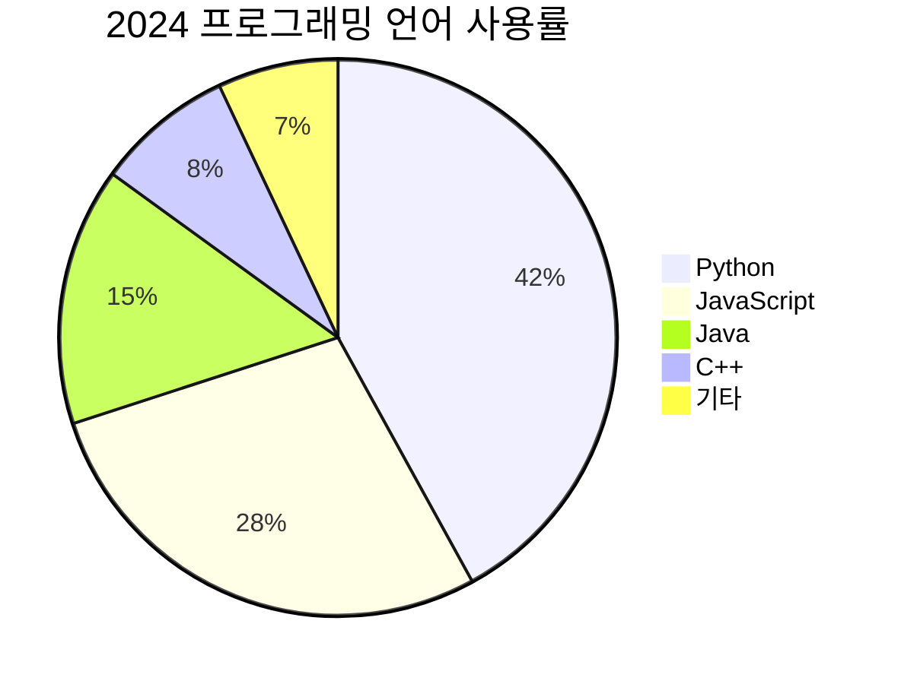

### 프로젝트 시간 분배
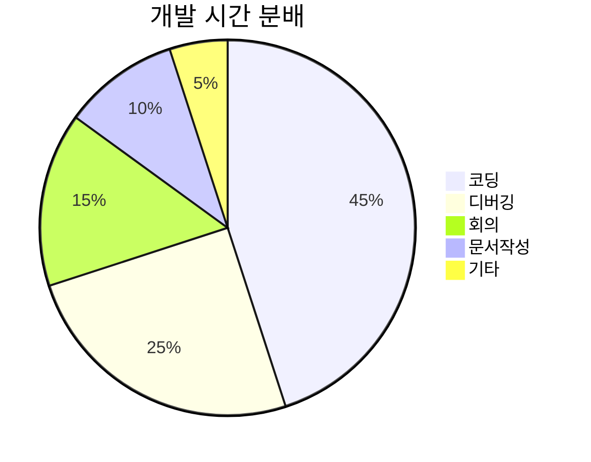

## 8. 타임라인 (Git Graph)

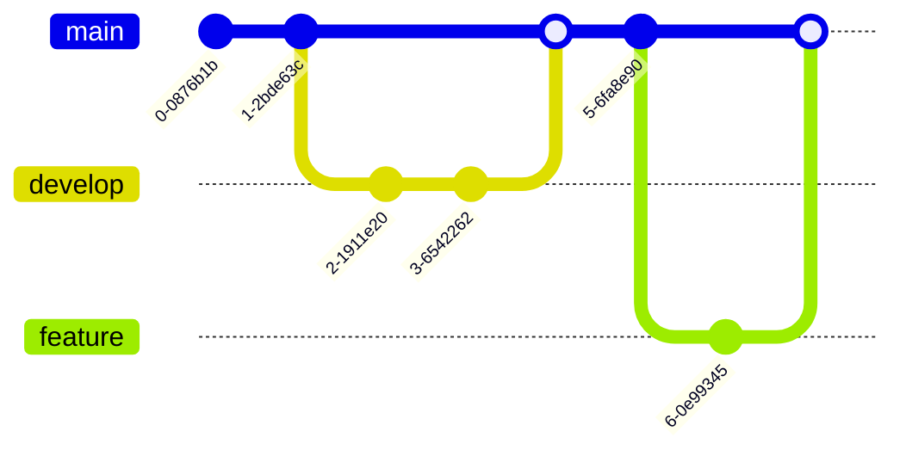

## 9. 마인드맵 (Mind Map)

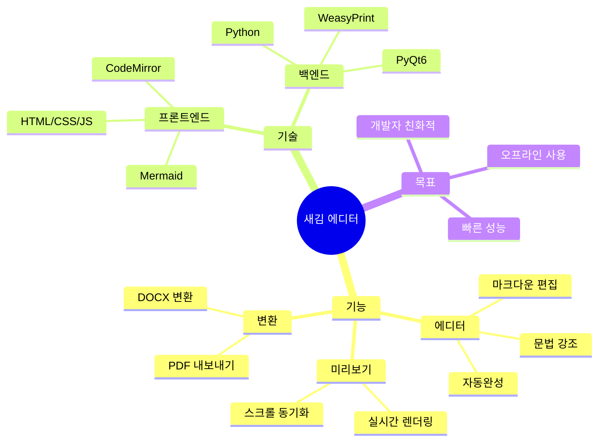

## 10. 요구사항 다이어그램 (Flowchart 방식 ✅)

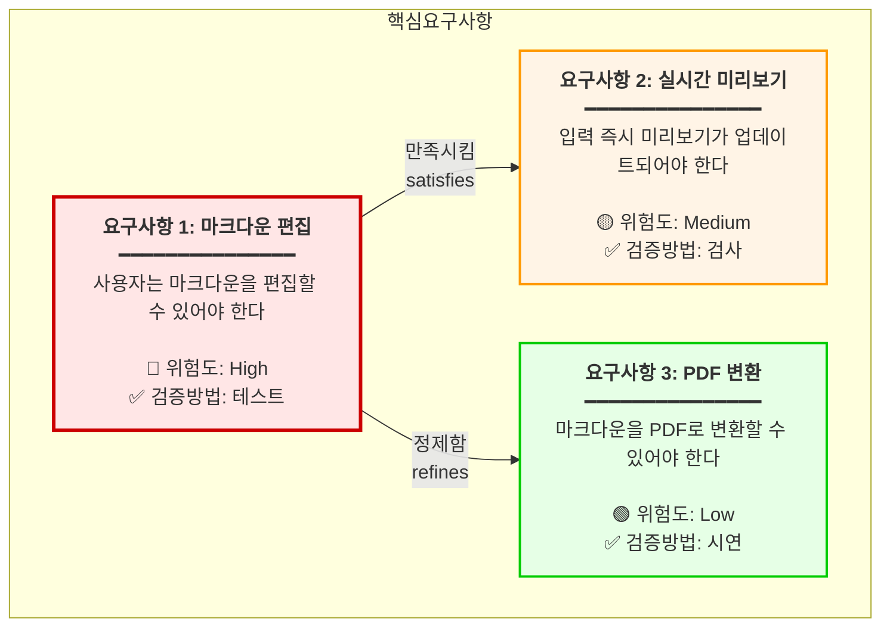

## 11. 사용자 여정 (User Journey)

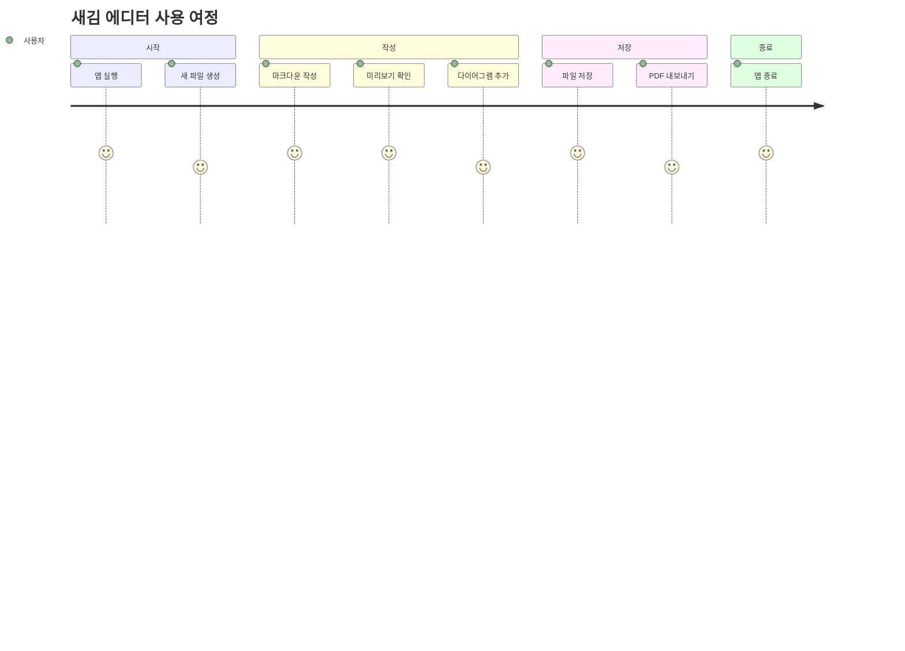

---

## 수정 사항 요약

### ✅ 수정된 부분: 요구사항 다이어그램

**문제점:**
- Mermaid의 `requirementDiagram`은 한글을 완전히 지원하지 않음
- `text` 필드에서도 한글 파싱 오류 발생
- Lexical error on line 4 발생

**해결책:**
- `requirementDiagram`을 `flowchart`로 완전 대체
- 한글 텍스트, 이모지, 스타일링 모두 정상 작동
- 위험도별 색상 구분 (High=빨강, Medium=주황, Low=초록)
- 관계 표현 유지 (satisfies, refines)

### 테스트 방법

1. 위의 코드 블록을 하나씩 복사해서 에디터에 붙여넣기
2. 오른쪽 미리보기에서 다이어그램이 렌더링되는지 확인
3. 터미널에서 `[JS Console]` 메시지 확인
4. 모든 다이어그램이 정상적으로 렌더링되어야 함

### 예상 결과

각 다이어그램이 깔끔하게 렌더링되어야 하며, 터미널에는:
- `🔍 Found X Mermaid code blocks`
- `✅ Rendered X Mermaid diagrams`

이런 메시지가 나타나야 합니다. **이제 요구사항 다이어그램도 정상적으로 작동합니다!**